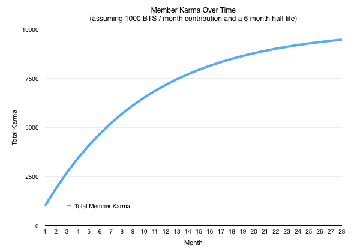
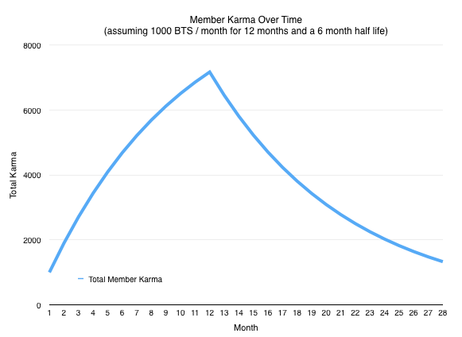
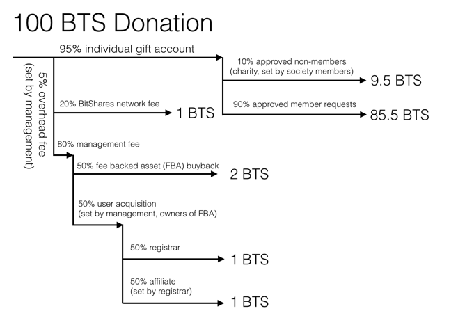

    BSIP: 0009
    Title: Benefit Society
    Authors: Fabian Schuh <Fabian@BitShares.eu>
             Daniel Larimer <dan@cryptonomex.com>
    Status: Draft
    Type: Protocol
    Created: 2015-12-16

# Abstract

This proposal allows individuals to form *benefit societies* on the BitShares
blockchain.

A benefit society, fraternal benefit society or fraternal benefit order is a
society, an organization or a voluntary association formed to provide mutual
aid, benefit, for instance insurance for relief from sundry difficulties.

# Motivation

The premise of this feature is to be an organizational tool for groups of
individuals working toward a common cause. The benefit of implementing this in a
decentralized business (e.g. on a blockchain) is to enable the formation of of
benefit societies that may be difficult or impossible to operate in the
traditional manner.

Prior to blockchain technology any attempt to set up such a cooperative society
would get shut down. The resources pooled by the members would be seized. The
creation of such an organization would involve incorporating a business or
nonprofit with the permission of the government. Such an organization would
become a "single target" that was far easier to attack than going after all of
its members individually. If you attempted to create such an organization
without incorporating then individual members would have incentive to defect
when they are needed (it would be the prisoner's dilemma all over again).

Now that we have blockchain technology we can create a system where the
individual members cannot "defect" because all funds are managed by smart
contracts. Meanwhile, the government would not have a single target to attack
and take down the entire operation by stealing the reserves. Taking down this
system would have to go after all of the members individually which we have already
established as being politically inviable. 

# Rational

## The Prisoner's Dilemma

As a society we are caught in what is known as the prisoner's dilemma. The
prisoner's dilemma is a canonical example of a game analyzed in game theory that
shows why two purely "rational" individuals might not cooperate, even if it
appears that it is in their best interests to do so. Here is an example of the
prisoner's dilemma:

Two freedom fighters are arrested, but prosecutors lack sufficient evidence to
convict them on the principal charge with a 2 year prison sentence. The
prisoner's hope to get sentenced to a lesser charge with just a 1 year prison
sentence. So the prosecutor offers each of them a deal, if they turn on the
other then they will be set free. So the options are as follows:

They both turn on each other and get a 2 year sentence They remain loyal and
both get a 1 year sentence One of them defects, and gets set free leaving the
other to rot in jail for 2 years

## Discussion

It is implied that the prisoners will have no opportunity to reward or punish
their partner other than the prison sentences they get, and that their decision
will not affect their reputation in the future. Because betraying a partner
offers a greater reward than cooperating with him, **all purely rational
self-interested prisoners would betray the other**, and so the only possible
outcome for two purely rational prisoners is for them to betray each other.

## Solution

To break the cycle of violence and passive acceptance we must change the rules
of the game and **offer incentives for people to cooperate** for mutual self
defense. What if the freedom fighters had a policy of paying for the legal
defense of its members and compensating them for any time spent in prison?
Under such a system, the incentive to defect would be dramatically reduced. It
would be completely eliminated if defection disqualified a member from future
benefits. This would leave the following potential outcomes:

Neither defect, and both members are paid to spend 1 year in jail One defects,
goes free, but loses protection of his fellow activists, and the other is paid
to spend 2 years in jail. Both defect, both spend two years in jail, and
neither get paid.

The rational actor under these choices will risk 1 paid year in jail rather than
2 unpaid years.

# How Benefit Society Work

1. Commit to supporting others within a society
2. Vote on which people qualify for help according to your societies policy
3. Give your pre-committed funds to authorized requests for help
4. Request help from the society when a qualifying event happens in your life
5. Receive donations from the members of the society you have supported

Each month you publicly commit funds to be given to other members of your
society. These funds are held in a Smart Contract that will only allow them to
be given to other members of your society with approval by a large minority (3%)
of the society.

When a member experiences an unexpected burden they request help from their
society. Members of the society will then vote to approve or reject the request.
If the request is approved then individuals with pre-committed funds may choose
to give to their cause. The more you give to a society, the more it will give
back to you many times over.

# Specifications

This proposal will not change any existing behavior on the BitShares blockchain
and only adds new operations, states and smart contracts. Furthermore, all
parameters given as suggestions can be chosen individually for each society and
are voted for within each society.

## Overview

Every member of a society commits money to their own individual gift reserve on
a regular basis to earn *karma* in that particular society. The ultimate
strategy for an individual is to contribute money on a monthly basis so that he
or she can maintain their desired level of karma.

By adding money to this gift reserve the user is committing to
donate that money to future claims of **other** members of the society and the
blockchain enforces that the money can only be used for that cause.

A claim must be verified by one or more elected oracles of the society. Oracles
are elected via karma weighted votes. Users can either be their own Oracle
(voting themselves) or they can delegate their power to someone else. Oracles
can vote for or against a claim and their vote is used **only** to certify the
facts of the claim are true. Among those facts are things like the person making
the claim is the owner, that they are in good standing, and that they had
sufficient karma at the time of the event in question.

To have a claim "approved" it must have a net positive vote greater than the
total karma held by the top 10 individual accounts by total karma. This measure
is designed to be high enough to prevent obvious fraud, but low enough that it
doesn't require every oracle to review and approve of every case. 

Once approved by the oracles it is up to individual members of the society to
transfer funds from **their** individual gift reserve to the individual in
question. This ultimately means that even if the oracle is "gamed", you must
still convince the users with money to give it to your claim. This is the final
check on the system and ensures that manipulating the voting for qualification
is independent of actually receiving a payout. In the end, all an oracle can do
is give a recommendation and prevent spam.

When a user chooses to fund a claim they receive karma for every dollar
they give to someone who has filed a claim. This is designed to incentivise
individuals to actually pay out claims rather than just lock up money in their
gift reserve. This karma have no vesting requirements because the funds in
the gift reserve vested along with the karma earned.

## Karma

When a user contributes to a society they earn Karma in that society. Karma is
what qualifies a user to receive benefits from that society. Karma fades over
time if a user does not maintain regular donations. The default half life for
Karma is about 6 months. This means that giving a fixed amount every month will
eventually result in a maximum Karma level around 10 times the monthly
contribution.

If after 12 months of consistent contributions a member stops making
contributions their Karma will gradually fall off, but will never quite hit 0.

Karma is also what gives members voting power over which requests for help are
qualified and which ones are not. Members earn half their Karma at the time
they contribute to their gift account and the other half of their Karma at the
time they allocate their gift to an approved request. In this way members are
encouraged to actively fulfill requests with their donations instead of letting
them accumulate for ever.

When a user files a request they use their Karma to request donations. There is
a ratio of the average donation received per Karma claiming donation.

## States

We propose to add three new states to the protocol that need to be tracked and
evaluated:

* **Society State**:
* **Membership State**:
* **Request State**:

### Society State

 | Field                    | Description                                                                            | 
 | ------------------------ | ----------------------                                                                 | 
 | Name                     | Used to identify the society. The name can be any UTF-8 string up to 60 characters.    | 
 | Description              | Defines the high level purpose of the society                                          | 
 | Creator                  | Account ID of the creator of this society. This account has permission to modify the   | 
 |                          | properties of this society until the first membership account is funded and Karma has  | 
 |                          | been issued. After Karma has been issued, the creator permissions are set to the top P | 
 |                          | membership accounts by total Karma vote.                                               | 
 | nControl                 | The number of members who have joint control over the creator account.                 | 
 | Decay Rate               | Defines the rate at which karma in a society decays (% per day)                        | 
 | Karma Ratio              | Defines the amount of karma each member earns per BTS of commitment                    | 
 | Vesting Period           | Defines the rate in seconds at which Karma vests                                       | 
 | URL                      | Defines a URL where more information about the society can be found                    | 
 | Total Karma              | Tracks the total karma issued to all members of this society                           | 
 | Approval Threshold       | The percent of karma voting required to approve a payment request                      | 
 | Total Approved Requests  | The total amount of Karma that has been approved for donations, this number can be     | 
 |                          | calculated by summing the requests                                                     | 
 | Total Payouts            | Total BTS given to active requests.                                                    | 
 | Charity Percent          | The percent of donations that may be given to charity requests                         | 
 | Active Charity Requests  | The number of active charity requests that are allowed.  The top N charity requests    | 
 |                          | by Karma approval voting may receive donations from member's charity account.          | 

### Membership State

| Field                     | Description                                                                   | 
| ------------------------- | ------------------------                                                      | 
| Membership ID             | Unique Identifier for this Membership                                         | 
| Account ID                | The BTS account which has control over this Membership                        | 
| Society ID                | The society this membership is a part of                                      | 
| Total BTS Given           | Tracks the life-time total of how much BTS has flowed through this membership | 
| Membership BTS            | BTS held in reserve that may only be given to other members                   | 
| Charity BTS               | BTS held in reserve that may be given to charity or other members             | 
| Karma                     | Current Karma within this society                                             | 

### Request State

| Field                     | Description                                              | 
| ------------------------- | ------------------------                                 | 
| Membership ID             | The society member making the request                    | 
| Subject                   | An 80 character title for the request                    | 
| Summary                   | A brief summary of the request                           | 
| Details                   | A detailed description of the request                    | 
| Karma Committed           | The total Karma being being used by this request         | 
| Total Karma For           | The total amount of Karma voting to approve this request | 
| Total Karma Against       | The total amount of Karma voting against this request    | 
| Total BTS Received        | The total BTS that has been given to this request        | 

## New Operations

* *Create Society* - This operation is similar to create asset. It defines a new
  society including a name, description, and any configurable parameters.
* *Join Society*  - This operation ties an existing BitShares account to a
  particular society and defines any relevant information associated with
  society membership. This information may include the user's real name, age,
  location, etc.  
* *Commit Funds to Society*  - This operation will transfer BTS from an account
  to a society membership.  It may be performed by any account. 1% of the BTS
  transferred will be paid to the BTS reserve pool, 2% of the BTS transfered
  will be allocated to the referral program, and 2% of the BTS transferred will
  be used to buy back a Fee Backed Asset dedicated to this feature.   The
  society membership will earn Karma within the society proportional to the BTS
  contributed.
* *Request Payout from Soceity* - This operation will create a payout request. A
  payout request includes Karma from the membership account requesting the
  payout and requires permission of the membership owner. The request includes a
  subject, summary, and detailed description explaining the justification.
* *Update Payout Request* - This operation can be used to update mutable
  properties of an existing payout request.
* *Approve or Reject Payout Request* - This operation is used to vote for or
  against paying out a particular request.  Each member of a society can vote
  with a weight equal to the amount of karma the account has earned.
* *Update Membership Info* - This operation is used to update mutable membership
  information such as nominating a proxy to vote on your behalf.  This is
  designed to simplify the amount of voting the average member must worry about.
* *Fund Payout Request* - This operation will transfer BTS held in the
  membership account reserve to an approved payout request.

## Maintenance Operations

The following actions will be performed during a maintenance interval block
(e.g. once a day):

1. Tally all relevant votes
2. Update management account authority for each society
3. Update management account authority for the fee backed asset 
4. Decay all Karma by the configured percentage

## Smart Contract

A smart contract will be integrated that will deal with the new operations,
derive the members karma and execute the proposals protocol as defined above.

# Charity Program

Every day there is need for money for individuals and charitable organizations
that haven't paid into the system. These individuals often get significant
organic donations to their cause. By allocating a portion of all funds
contributed to those high-profile victims the network can also gain good will
and free advertising. A suggested rate of 5% of all gifts should be allocated to
non-contributing high-profile needs.

## Referral Program, Fees and Monetization of this Proposal

All insurance-like systems depend upon having a large number of people pooling
risk. The more people involved the more evenly the risk is spread and the more
money there is available for funding claims. All insurance companies must charge
enough to cover not only the claims made, but also the advertising campaigns
that they run continuously on TV and Radio stations across the country. 

A peer to peer society systems demands a decentralized, peer-to-peer
advertising campaign. This means that part of every dollar contributed toward
helping others is paid the person who referred you to the program. Everyone
paying into the system benefits from funding marketing campaigns targeted at
finding new users. A suggested rate of 10% of all gifts are paid to your
referrer until you become a life time member and qualify for referring others.

We propose to distribute the fees as follows: A donation (i.e. funding of the
personal gift reserve) of 100 BTS results in 5 BTS in fee. Of this 5 BTS fee,
the usual 20% go to the BitShares shareholders as burned shares and the other
80% are management fees. These are given 50%/50% to the holders of a
society-specific [fee backed asset](bsip-0007.md) and the referral program.

# Applications

## Injustice Sharing

Injustice occurs anytime an innocent person is harmed by the government or
anyone else. In this case, innocent means someone who has not committed fraud
nor initiated aggression against someone else. This means that everyone accused
of a victimless crime is suffering an injustice. 

In the most general sense injustice is not always black and white and varies in
the eyes of every individual. Some people would see drunk driving as initiating
aggression even if no one was actually hurt and no property was damaged. In
other words, some people subscribe to the theory that harm can be ascribed to
mere endangerment. If driving drunk increases the chances of harm by 5% then
the damage caused by driving drunk is 5% of the average damage caused people who
drive drunk and actually do harm people. Regardless of which stance you happen
to hold, it is clear that justice is subjective and therefore, so is injustice.

Some injustices are universal and endured by everyone. In these cases the cost
of sharing the injustice would equal the cost of everyone paying their own way.
One example that everyone suffers from is payroll taxes. Almost everyone suffers
from this and it is almost universally enforced. 

The point of injustice sharing is to distribute the burden of injustice that is
somewhat randomly or selectively applied to particular individuals. Examples of
this include regulatory violations, getting audited, traffic tickets, getting
caught with certain substances, copyright violations, asset forfeiture, etc. In
all of these cases there are thousands of people who escape the injustice for
every individual who is caught and suffers. 

The primary goal of Injustice Sharing is to motivate individuals to commit to
helping one another in the face of injustice. What qualifies as injustice and
how much help each individual should receive and from whom is all subjective,
but this does not necessarily interfere with achieving the desired objective.

You motivate people to help one another by requiring them to commit money in
advance so that they can qualify for help from others. Then you only allow them
to allocate the money they have committed to other members when a qualified
injustice claim has been filed. Then you limit the maximum payout for a claim
to be a function of total funds committed by a user, total users who have filed
a claim, and the total amount paid out via claims. The exact equations will be
provided later.

## Cooperation via Mutual Aid Society

Prior to the welfare state individuals would organize in voluntary societies
where they would all contribute to helping one another. The amount of help
someone would receive from such a society depended upon how much they
contributed. Someone who contributed a lot would be helped a lot, whereas
someone expecting a handout would not get much help. In many ways these Mutual
Aid Societies were like insurance companies where the insured would directly
help each other with more than just money. 

Before the government got involved and regulated them out of existence to be
replaced by modern insurance companies and the welfare state, the majority of
the population participated in one or more of these societies. People got the
help and care they needed at affordable costs without the need for violence.

I believe that it is through this type of organization that we can come together
as free men and women to defend our life, liberty, and property. Most government
abuses have a distribution among members of society similar to cancer. Most
people don't get it, but when you do the medical bills can bankrupt you. Like
cancer, some people have higher risks of getting caught and suffering as a
result but it can and does affect the most health conscious individuals. People
spend hundreds of dollars each month to defend themselves against health issues
that are less likely than becoming the victim of their own government. 

# Discussion

## BTS denominated

Funds given to your gift reserve are denominated in BTS (the core asset in
BitShares), a *volatile* currency. The question as to whether societies should
be allowed to be denominated in other assets is unanswered and requires further
discussion.

## Preventing Fraud

Like traditional insurance, measures must be taken to prevent fraud and equalize
risk. The most basic measure is that only the individual who contributed funds
can file a claim. This prevents selling the benefits of being a member to
someone after an society-covered event has occurred and payout is guaranteed.

Next all claims must have their facts certified by one or more trusted (elected)
entities. These entities are responsible for verifying whether or not the claims
are accurate, complete, and whether the individual is currently in good standing
with the community. Good standing requires that individuals have no open claims
against them and have not harmed or defrauded anyone.

Once a claim has been approved and assigned a maximum payout, the other members
must choose to fund the claim from their own contributions. This means that
members must find sympathy within the community for their case. These other
members have funds pre-allocated that they can only spend funding claims. When
they do fund a claim, they gain extra "lottery tickets" which means that those
who fund claims can make larger claims than those who merely fund their policy
and never pay a claim. In a properly balanced "insurance" market that does not
build up a reserve, total income in any given month should equal the total
claims in that month. If a reserve is built up then either people are
over-paying or under claiming. Some reserve is useful because not all months are
equal, but the principle remains that on average today's income must equal
today's claims.

Users can be assured of payout anytime there are ample reserves because there
are more people looking to pay a claim than there are claims. In other words,
for every person with a claim there are 1000 people who are looking for someone
to help.

The result of this structure is that all payouts are governed by the subjective
approval of fellow users and all funds flow directly from one user to another.
This avoids the creation of a pool of funds held in a centralized location with
centralized decision making power. If most users don't want to support
reimbursement of a drunk driving ticket then the drunk driver may have a harder
time getting that covered than someone caught for a more sympathetic crime such
as whistle blowing.

## Unpleasant Societies

This proposal adds a means to create arbitrary societies that follow a particular
*goal* or *motivation* that does not require shareholders' approval. Hence, we
may see societies that individual shareholders may find unpleasant, offensive or
disturbing. However, BitShares is dedicated to finding free market solutions to
secure life, liberty, and property to all and as such highly values freedom of
speech. Hence, it holds:

> "I may not like your society, but I will defend your right to have it."
>  -- Daniel Larimer

# Summary for Shareholders

This proposal adds a new feature to BitShares that runs independently of other
features and requires [BSIP-0007](bsip-0007.md) to be implemented and available.

The proposed feature allows to create and grow arbitrary mutual benefit
societies within the BitShares Decentralized Autonomous Company and probably
draws attention and fresh capital into BitShares.

Shareholders of BitShares profit from an increased exposure to the public,
increased usage of the platform and higher demand for BTS on external exchanges
and/or the internal decentralized exchange (assuming proper gateway
infrastructure).

The regulatory risks have been solved by letting BitShares, a decentralized
entity, execute the smart mutual aid contract and issue karma according to a
mathematical formula.

Since societies can be creates without shareholder approval, we may also face
negative PR created from societies that do not find much support among people.

# Copyright

This document is placed in the public domain.

# See Also

* https://bitsharestalk.org/index.php/topic,20640.0.html
* https://bitsharestalk.org/index.php/topic,20431.0.html
