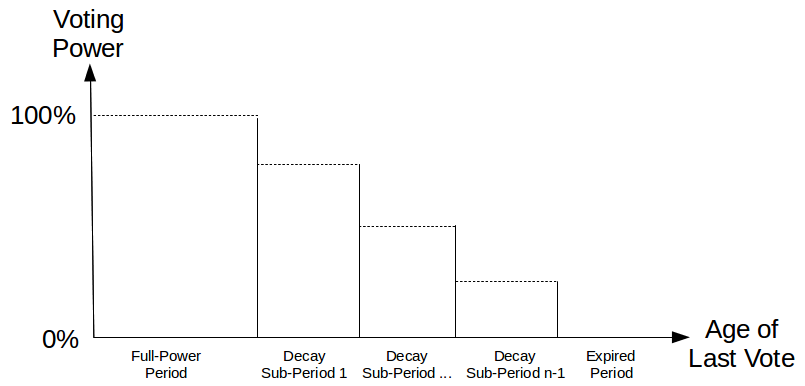
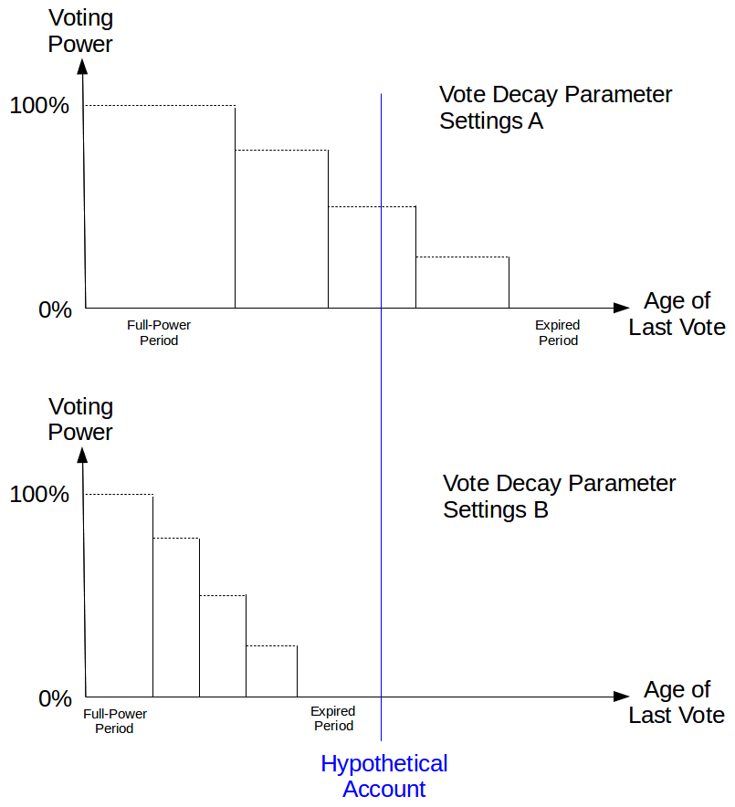
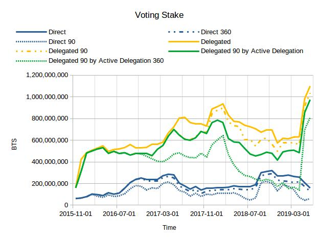
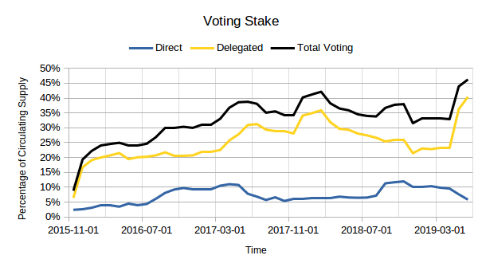

    BSIP: 0022
    Title: Vote Decay for Witnesses, Committee members & Proxies within the BitShares network
    Authors: [Customminer](https://steemit.com/@cm-steem/)
    Authors of relevant BSIP-0005: Daniel Larmier <Dan@cryptonomex.com>
                              Fabian Schuh <Fabian@BitShares.eu>
    Status: Draft
    Type: Protocol
    Created: 2017-07-06
    Primary discussions: <https://github.com/cryptonomex/graphene/issues/265>
                         <https://bitsharestalk.org/index.php/topic,18109.0.html>
                         <https://github.com/bitshares/bitshares-core/issues/73>
                         <https://github.com/bitshares/bsips/issues/28>
                         <https://github.com/bitshares/bsips/pull/153>
    Similar discussions: <https://github.com/steemit/steem/issues/953>

# Abstract

This BSIP proposes to introduce an expiration on votes cast within the BitShares network so as to encourage an active voting population and campaigning by those who desire being voted into power.

# Motivation

Currently within BitShares DPOS system, an user's votes for committee/witness/proxy representatives are permanent unless changed by the voter at a later date.

# Rationale

* Permanent votes introduce the danger of enabling an [oligarchy](https://en.wikipedia.org/wiki/Oligarchy) within the BitShares network, we should be encouraging a more [democratic](https://en.wikipedia.org/wiki/Democracy) network.
* Campaigning efforts since the upgrade from BTSX (0.9x) to BTS 2.0 have drastically stagnated.
* There were plans for a '[DPOSHub](https://web.archive.org/web/20170530183557if_/https://bitshares.org/newsletter/2015/nullstreet/the_nullstreet_journal_0-5.pdf#Issue%200.5%20final.indd%3A.7289%3A125)' to stimulate DPOS campaigning efforts, however this was not implemented so DPOS campaigning is limited.
* The 'Stakeholder proposal' subforum on BitSharesTalk is not as active as it should be, many threads on BitSharesTalk haven't received updates in a long while.
* There's a grim reality that humans (our primary userbase for now) eventually die, potentially with insufficient procedures in place for their relatives to recover their crypto-assets. Dead users cannot be convinced to change their cast votes, thus their votes are permanent regardless of their chosen representatives future activity/behaviour.
* Non-expiring votes places new applicants at a disadvantage as they need to compete with the long established large vote weights that the currently active witnesses/committee users have.
* In order to remove malicious actors from positions of power the concerned parties have to effectively engage in smear campaigns across multiple BitShares communication portals; Having to engage in this type of activity can be a negative experience for all users involved and could potentially damage the reputation of the campaigners and the network. Inactive users who have voted for said malicious users may never take notice of such a negative campaign or may be apathetic to voting, negating the purpose of such a smear campaign (thus the malicious entity potentially remains in power).
* The previous BSIP-0005 proposed by Dan Larimer & Fabian Schuh back in 2015 was primarily deferred due to a lack of sufficient detail in the BSIP, this BSIP has far more detail.

## Vote Decay on Other Blockchains

### <div id="eos-vote-decay" /> Vote Decay on EOS

Vote decay was [introduced into the EOS blockchain with Dawn 4.0](https://medium.com/@auroraeos/understanding-eos-vote-decay-e50c58b56658).  The maximum voting power of an account is a function of [the core tokens that are staked by that account](https://github.com/eosio/eos/eosio.system/blob/bfd1793032ed69bba8047b4807f692eaed2ed5e5/eosio.system/src/voting.cpp#L228).  This maximum effectively [step decays](https://github.com/eosio/eos/eosio.system/blob/bfd1793032ed69bba8047b4807f692eaed2ed5e5/eosio.system/src/voting.cpp#L122-126) every week [by 1.34%](https://www.eoscanada.com/en/how-is-your-vote-strength-calculated-on-eos) unless the account re-casts its votes.  The vote "decay" is technically implemented by [strengthening newer votes](https://github.com/eosio/eos/eosio.system/blob/bfd1793032ed69bba8047b4807f692eaed2ed5e5/eosio.system/src/voting.cpp#L122-126).  The age of the last casted vote [affects the voting power for all referendums](https://github.com/eosio/eos/eosio.system/blob/bfd1793032ed69bba8047b4807f692eaed2ed5e5/eosio.system/src/voting.cpp#L200-319) on the platform.  The decaying of votes for block producers [reduces the amount of pay](https://github.com/eosio/eos/eosio.system/blob/bfd1793032ed69bba8047b4807f692eaed2ed5e5/eosio.system/src/producer_pay.cpp#L153-171) received by [standby block producers](https://medium.com/eostribe/how-eos-block-producers-are-paid-7b2a1216eb2b).

### <div id="peerplays-vote-decay" /> Vote Decay on Peerplays

A [proposal for Peerplays](https://github.com/peerplays-network/pips/blob/master/pip-0002.md) introduced vote decay as an element of its Gamified Proof of Stake (GPOS).  Voters receive rewards from a portion of the operation fees and "rakes" that are collected by the blockchain.  The reward is contingent on [the amount of stake that is vested by the voter](https://github.com/peerplays-network/peerplays/blob/78dcc7df7316a0fcae8c14b7b648b88caa956326/libraries/chain/db_maint.cpp#L1072-1080), and [the age of last casted vote by the voter](https://github.com/peerplays-network/peerplays/blob/78dcc7df7316a0fcae8c14b7b648b88caa956326/libraries/chain/db_maint.cpp#L726-791).  The age of the last casted vote [also decays the voting power](https://github.com/peerplays-network/peerplays/blob/78dcc7df7316a0fcae8c14b7b648b88caa956326/libraries/chain/db_maint.cpp#L1446-1447) for all referendums on the platform.


# Specifications

## <div id="referendum-categories" /> Referendum Categories

BitShares has three categories of referendums that core token holders may vote on: witnesses, committee members, and worker proposals.  Prior to this proposal, any vote within any category applies until changed or until the proxy assignment had been assigned.  The retraction of proxy delegation re-instates a core token holders' prior voting selection for witnesses, committee members, and worker proposals.

This proposal shall retain the ability of every core token holder to vote on all referendum categories and the optional delegation to a voting proxy.

Votes for two of the referendum categories shall be "decayable": witnesses and committee members.  [Votes for worker proposals shall not be decayable](#out-of-scope) and shall continue to be tabulated as they were prior to this proposal because they are generally fixed in duration.  [Vote delegation to a proxy shall also be decayable](#proxy-power).


## <div id="account-voting-stake" /> Voting Stake of an Account

The full power of an account's vote equals the [the sum of](https://github.com/bitshares/bitshares-core/blob/bf7ff54d9a17aa43f4663521e371b8c0ddfc2284/libraries/chain/db_maint.cpp#L1184-1186) an account's liquid core tokens (BTS), core tokens in vesting balances, and core tokens in open orders including [collateral that is used for shorting smart assets into existence](https://github.com/bitshares/bitshares-core/blob/bf7ff54d9a17aa43f4663521e371b8c0ddfc2284/libraries/chain/market_evaluator.cpp#L234-245).

_The full power of an account's vote will automatically be updated to reflect any changes to the liquid balance, vesting balance, or core tokens in open orders_.

This proposal shall retain the calculation for the maximum voting stake of an account.  _The full voting stake of an account may be expanded by future BSIPs to include core tokens in other balances and other tokens_.


## Schedule of Voting Power Tallying

Vote power tallying retains the existing schedule for vote tallying which occurs during every maintenance interval.

---

<center>**Example of Vote Tallying**</center>

The maintenance interval for the blockchain is configured by the Committee to occur every 24 hours.  Maintenance was last triggered on December 31, 2019 at 14:00 UTC.

A voter changes their vote for witnesses on December 31, 2019 20:00 UTC.  This voter's change of vote shall take effect during the next maintenance interval on January 1, 2020 at 14:00 UTC.

---


## <div id="vote-decay-function" /> Voting Power Decay Function



The voting power of an [account's voting stake](#account-voting-stake) shall be set to full voting power whenever an account's vote is re-cast for _any_ [referendum category](#referendum-categories) or is re-delegated to a voting proxy.  The voting power shall remain at 100% for each of the referendum categories for the entire ["full-power period"](#vote-decay-parameters).

After the full-power period, the voting power shall begin to decay towards zero during a "decay period" for witnesses, committee members, and proxy delegation.  Decay shall occur in a stepped fashion during the decay period.  The [quantity of decay steps (n) shall be determined by the BitShares Committee](#vote-decay-parameters).  There shall be (n - 1) decay periods.  The duration of each stepped voting period (sub-period) shall equal the total vote decay duration divided by the number of decay periods.  The voting power (P<sub>i</sub>) during decay period i shall be

P<sub>i</sub> = (n - i) &div; n = 1 - (i &div; n)

After the last decay period has expired, the voting power shall reduce to zero until either the account re-casts its votes, or the [vote decay parameters are adjusted](#vote-decay-parameters) such that the age of the account's last vote within that category possibly moves from "expired" to the the "decay age" or "full-power age".

In summary, the age of a category vote by an account will typically decay from "full-power" through "decaying" to "expired" unless and until the account re-casts its voting slate in any referendum category or re-delegates a voting proxy.

---

<center>**Example of Vote Decay**</center>

The vote decay parameters for witness voting have been set to 365 days for the full-power duration, 180 days for the total vote-decay duration, and 4 vote decay steps.  Each vote-decay sub-period has a duration of 60 days.

A voter changes their vote for witnesses on December 31, 2019, and then does not vote again until December 31, 2025.

|Date Range|Voting Power|
|-|-|
|January 1, 2020 through December 31, 2020|100%|
|January 1, 2021 through March 2, 2021|75%|
|March 3, 2021 through May 2, 2021|50%|
|May 3, 2021 through July 2, 2021|25%|
|July 3, 2021 through December 31, 2025|0%|
|January 1, 2026 through December 31, 2026|100%|

---

## <div id="separate-decay-rates" /> Separate Decay Rates

This proposal shall [decay]((#vote-decay-function)) the voting power for [decayable referendum categories and proxy delegation](#referendum-categories) at different rates of decay that can be [adjusted by the BitShares Committee](#adjustable-vote-decay-parameters).  Consequently the voting power of an account for different referendum categories may, depending on the decay parameters, decay to zero before others.

A vote in any referendum category or the re-delegation to a voting proxy will reset the [latest vote date](https://github.com/bitshares/bitshares-core/blob/bf7ff54d9a17aa43f4663521e371b8c0ddfc2284/libraries/chain/include/graphene/account_object.hpp#L73) which will reset the "vote decay clock" across each of the referendum categories.

---
<center>**Example of Different Vote Decay Rates**</center>

An account with a balance of 200 BTS votes both for a slate of witnesses and a slate of comittee members.

The decay parameters for these two referendum categories are shown in the table below.

|Referendum Category|Full-Power Duration|Decay Duration|Number of Decay Steps|
|-|-|-|-|
|Witnesses|75 days|50 days|2|
|Committee Members|200 days|100 days|4|

The voting power since the date of last vote is shown in the table below.

|Age of Last Vote|Voting Power for Witnesses|Voting Power for Commitee Members|
|-|-|-|
|0 days|200|200|
|25 days|200|200|
|50 days|200|200|
|75 days|200|200|
|100 days|100|200|
|125 days|0|200|
|150 days|0|200|
|175 days|0|200|
|200 days|0|200|
|225 days|0|150|
|250 days|0|100|
|275 days|0|50|
|300 days|0|0|

The voting power for these two referendum categories will remain at 0 until the account re-casts its votes or re-delegates a voting proxy at which time it will return to 100%.

---

## <div id="proxy-power" /> Cumulative Voting Power of a Proxy

A core token holder (a "delegator") may choose to delegate their voting power to another account (a "proxy").  The weight of the delegator's voting power passes through as a supplement to the proxy's voting stake for as long as the delegation is active.  The cumulative voting stake of a proxy is therefore the aggregate of the proxy account's own voting stake **plus the decayed voting power of its delegators**.  This cumulative voting stake shall further [be decayed](#vote-decay-function), except for [votes about worker proposals](#proxied-votes-for-worker-proposals), based on the last voting date of the proxy account to avoid the effects of a situation where diligent delegators are selecting an "absentee proxy".  Consequently the cumulative voting power of a proxy can decay over time due to infrequent vote re-casting by its delegators _and_ by the proxy account.

---

<center id="example-proxy-vote-decay-for-committee-membership">**Example of Proxy Vote Decay for Committee Membership**</center>

Account A has a [voting stake](#account-voting-stake) of 1000 BTS.  Account B has a voting stake of 500 BTS.  Account C has a voting stake 20 BTS.

Account A has delegated Account C to be its voting proxy but [sufficient time has elapsed since this proxy assignment](#separate-decay-rates) such that the effective delegation has decayed to 75%.

Similary, Account B has delegated Account C to be its voting proxy but [sufficient time has elapsed since this proxy assignment](#separate-decay-rates) such that the effective delegation has decayed to 50%.

Account C, the proxy, voted for committee members long enough ago such that his [voting power for the committee membership category has decayed](#separate-decay-rates) to 25%.

The cumulative voting power of Account C is shown in the table below.

|Account|[Voting Stake](#account-voting-stake)|Proxy Voting Power|Proxied Votes|Commitee Membership Voting Power of Proxy at 25%|
|-|-|-|-|-|
|Account A|1000 BTS|75%|750 BTS|187.5 BTS|
|Account B|500 BTS|50%|250 BTS|62.5 BTS|
|Account C|20 BTS|N/A|N/A|5 BTS|
|**Cumulative**||||**255 BTS**|

If the proxy, Account C, then re-casts his vote for any referendum category, his voting power for Committee Membership will get updated, and his updated cumulative voting power will increase as shown in the table below.

|Account|[Voting Stake](#account-voting-stake)|Proxy Voting Power|Proxied Votes|Commitee Membership Voting Power of Proxy at 100%|
|-|-|-|-|-|
|Account A|1000 BTS|75%|750 BTS|750 BTS|
|Account B|500 BTS|50%|250 BTS|250 BTS|
|Account C|20 BTS|N/A|N/A|20 BTS|
|**Cumulative**||||**1020 BTS**|

If Account B also immediately renews his proxy delegation to Account C, then the cumulative voting power for Commiteee Membership will increase as shown in the table below.

|Account|[Voting Stake](#account-voting-stake)|Proxy Voting Power|Proxied Votes|Commitee Membership Voting Power of Proxy at 100%|
|-|-|-|-|-|
|Account A|1000 BTS|75%|750 BTS|750 BTS|
|Account B|500 BTS|100%|500 BTS|500 BTS|
|Account C|20 BTS|N/A|N/A|20 BTS|
|**Cumulative**||||**1250 BTS**|

---

### <div id="proxied-votes-for-worker-proposals" /> Proxy Voting Power for Worker Proposals

Votes for worker proposals by a proxy shall be tabulated with the _full power_ of the proxy account _plus_ the _decayed delegated voting power_ of its delegators.  **This cumulative voting power shall not be decayed** [because worker proposals are outside the scope of this proposal](#out-of-scope).

---

<center id="example-proxy-vote-decay-for-worker-proposal">**Example of Proxy Vote Decay for a Worker Proposal**</center>

Account A has a [voting stake](#account-voting-stake) of 1000 BTS.  Account B has a voting stake of 500 BTS.  Account C has a voting stake 20 BTS.

Account A has delegated Account C to be its voting proxy but [sufficient time has elapsed since this proxy assignment](#separate-decay-rates) such that the effective delegation has decayed to 75%.

Similary, Account B has delegated Account C to be its voting proxy but [sufficient time has elapsed since this proxy assignment](#separate-decay-rates) such that the effective delegation has decayed to 50%.

Account C, the proxy, votes for a worker proposal called "Worker Proposal 1".

The cumulative voting power of Account C is shown in the table below.

|Account|[Voting Stake](#account-voting-stake)|Proxy Voting Power|Proxied Votes|Voting Power for "Worker Proposal 1"|
|-|-|-|-|-|
|Account A|1000 BTS|75%|750 BTS|750 BTS|
|Account B|500 BTS|50%|250 BTS|250 BTS|
|Account C|20 BTS|N/A|N/A|20 BTS|
|**Cumulative**||||**1020 BTS**|

While Account C maintains support for Worker Proposal 1, it will maintain the support of the cumulative voting power of the proxy.  If delegators do not update their delegation to this proxy, their delegation will continue to decay which will be reflected in a reduced cumulative voting power for the proxy which will then flow through to the supported worker proposal.  For example, if Account A and B have not updated their delegation and their delegation has decayed by an additional 10%, then the cumulative voting power for the worker proposal will also be reduced as reflected in the table below.

|Account|[Voting Stake](#account-voting-stake)|Proxy Voting Power|Proxied Votes|Voting Power for "Worker Proposal 1"|
|-|-|-|-|-|
|Account A|1000 BTS|65%|650 BTS|650 BTS|
|Account B|500 BTS|40%|200 BTS|200 BTS|
|Account C|20 BTS|N/A|N/A|20 BTS|
|**Cumulative**||||**870 BTS**|

If the proxy, Account C, later _withdraws support_ for Worker Proposal 1 then the cumulative voting power for that worker proposal will be withdrawn.

|Account|[Voting Stake](#account-voting-stake)|Proxy Voting Power|Proxied Votes|Voting Power for "Worker Proposal 1" after Proxy Support is Withdrawn|
|-|-|-|-|-|
|Account A|1000 BTS|65%|650 BTS|0 BTS|
|Account B|500 BTS|40%|200 BTS|0 BTS|
|Account C|20 BTS|N/A|N/A|0 BTS|
|**Cumulative**||||**0 BTS**|

This example demonstrates that even though direct votes for a worker proposal do not decay with time they can still be withdrawn at any time.

---


## <div id="vote-decay-parameters" /> Adjustable Vote Decay Parameters

The BitShares Committee shall be able to adjust the three voting parameters that affect vote decay calculations across the [_two_ decayable referendum categories and proxy delegation](#referendum-categories).  The parameters within each decayable referendum category and proxy delegation are: full-power duration; total decay duration; quantity of decay steps.  There will consequently be a total of 9 parameters that can be altered by the Committee:

1. full-power duration for witness slate
2. total decay duration for witness slate
3. quantity of decay steps for witness slate
4. full-power duration for committee slate
5. committee total decay duration for committee slate
6. committee quantity of decay steps for committee slate
7. full-power duration for proxy delegation
8. total decay duration for proxy delegation
9. quantity of decay steps for proxy delegation

### <div id="vote-decay-parameters-decay-duration" />Changing the Decay Duration of a Referendum Category



A reduction of either full-power duration or the decay duration could have the effect of reducing the voting power of an account by effectively aging an account's vote to "expired" status from either "full-power" or "decaying" status.  A qualitative example of this can be seen in the figure if the decay parameters are changed from Settings A to Settings B.

Similarly, an increase of either the full-power duration or the decay duration can increase the voting power of an account by effectively rejuvenating an account's vote from "expired" status to either "decaying" or "full-power" status, or from "decaying" to "full-power" status.  A qualitative example of this can be seen in the figure if the decay parameters are changed from Settings B to Settings A.


### <div id="vote-decay-parameters-decay-steps" /> Changing the Decay Steps of a Referendum Category or Proxy Delegation

Changing only the quantity of decay steps can potentially change the voting power of accounts _whose voting age fall within the decay period_.  The change in voting power for these accounts is a function of both the change in the quantity of decay steps, and the account's voting age.

**Note**: The change in voting power is relevant to core token holders in evaluating how their voting power may immediately change. However this change is irrelevant to the vote tallying because it depends only on the current settings of the chain parameters _at that point in time_ and not on the settings that were valid at the previous vote tallying.


## <div id="initial-voting-power" /> Initial Voting Power

Vote decay will have no effect on any account prior to the activation of this proposal with a hardfork date ("activation date").  After this proposal is activated, the **effective** [latest vote date](https://github.com/bitshares/bitshares-core/blob/bf7ff54d9a17aa43f4663521e371b8c0ddfc2284/libraries/chain/include/graphene/account_object.hpp#L73) for the purpose of vote decay calculations, shall be considered to be the activation date.  The activation date will effectively become the [start of the full-voting period](#vote-decay-function) for every account.  All votes that exist at the time of the activation date will initially have maximum voting power across every referendum category and proxy delegation.

Any subsequent voting by an account will set a new latest vote date for an account that will reset the [vote decay clock](#separate-decay-rates) for that account.


## Comparisons

|Element|Proposal|[Peerplays GPOS](#peerplays-vote-decay)|[EOS](#eos-vote-decay)|
|-|-|-|-|
|Decay Rate|Full-power during initial period followed by stepped decrease during decay period until reaching zero power|Full-power during initial sub-period followed by stepped decrease until reaching zero power|Full-power during initial period followed by stepped increase of newer votes by other accounts|
|Effect of decay rate on referendum issues|Separate decay rates for every _decayable_ referendum category and proxy delegation|Single decay rate shared by every referendum category|Single decay rate shared by every referendum category|
|Effect of decay rate on other issues|None|Decays the share of blockchain profits that are received by an account|Decays the share of payment for standby block producers|

## <div id="software-specs"/> Software Specifications

The following specifications are proposed for implementation.

**Note 1:** Calculation of durations (e.g. days) are independent of the local calendar and timezone (e.g. Daylight Savings Time is ignored)

**Note 2:** "Implementation hints" are not to be considered part of the formal specification, but merely as a *possible* implementation.

### Vote Decay parameters

The following vote decay parameters shall be selectable by the BitShares Committee.

```
struct category {
   bool active;
   unsigned_int full_power_duration; // days
   unsigned_int total_decay_duration; // days
   unsigned_int total_decay_steps;
};

struct vote_decay {
   category witness;
   category committee_member;
   category worker;
   category proxy_delegator;
};
```

- `full_power_duration` and `total_decay_duration` are defined in units of a day and shall each have a minimum value of one (1)
	- "Days" are defined as periods of 86400 seconds. Local calendars are ignored, as are Daylight Savings Times and other irregularities.
- `total_decay_steps` shall have a minimum value of one (1)
- `total_decay_duration` in all categories shall be divisible by `total_decay_steps`

**Implementation hints:**

- parameters can be added as child of extensions of the blockchain properties, for example:

```
parameters.extensions.vote_decay.proxy_delegation.active = true;
parameters.extensions.vote_decay.workers.full_power_duration = 7776000;
etc.
```

### Account's Last Voting Time

The [BitShares Core Feature Release of 201902](https://github.com/bitshares/bitshares-core/milestone/18?closed=1) introduced [the recording of an account's last vote time](https://github.com/bitshares/bitshares-core/pull/1449/) and this implementation of this BSIP can re-use it to determine an account's last voting time.

The behavior of that functionality is consistent with the intent of the proposal in that any changes to an account voting slate, even the removal of proxy delegation, is considered an updated an acccount's last voting time.


### Calculation of Voting Power

The calculation of voting power is currently performed by the [vote_tally_helper](https://github.com/bitshares/bitshares-core/blob/bf7ff54d9a17aa43f4663521e371b8c0ddfc2284/libraries/chain/db_maint.cpp#L1178) during chain maintenance.

It is here that the vote decay could be applied by calculating a voting stake multiplier (&alpha;) which for vote decay would be equal to or less than one (&alpha; &le; 1).  This new function (`calculate_voting_power(opinion_account)`) will calculate the multipler as a function of the current decay parameters and the account's age of last vote.

Any account may have four (4) different multipliers for each of the three (3) referendum categories and the one (1) proxy delegation.  Therefore the `calculate_voting_power(opinion_account)` should account for these different multipliers.

The developer is free to to code the `calculate_voting_power()` function in an efficient way to avoid potential performance problems with this calculation.

An [implementation of vote decay](https://github.com/peerplays-network/peerplays/blob/qa_gpos_18.04/libraries/chain/db_maint.cpp#L728-L785) that is [proposed for Peerplays](#peerplays-vote-decay) may be helpful for comparison.

This multiplier may then be used [inside of the account loop](https://github.com/bitshares/bitshares-core/blob/bf7ff54d9a17aa43f4663521e371b8c0ddfc2284/libraries/chain/db_maint.cpp#L1182) by checking what is being voted for by the account and then decaying _each referendum category_ with the appropriate multiplier.


### Test cases

All the scenarios described in this BSIP should be added as test cases plus additional edge cases.

# Risks

- [Vote decay](#vote-decay-function) can negatively impact voters
	- (a) who lost the keys to their account but have been content with how their old votes were cast,
	- (b) who are _unaware_ of its existence and who are expecting the effects of their votes to apply perpetually, or
	- (c) who are _aware_ of its existence but cannot easily determine the age of their last vote.
		- This risk can be mitigated by client software that displays the age of an account's last vote with the [new API calls](#software-specs-api) that provide information about the vote decay parameters, and an account's last voting time

- The effects of vote decay, especially during the decay of the [initially "grandfathered" votes](#initial-voting-power), may result in sudden changes to the elected witnesses, and committee members.  This sudden change could be  disruptive to those witnesses, and committee members that are suddenly voted out.

- Core token holders who delegate to [a voting proxy who fails to re-cast his own votes periodically will have their effective voting power decay over time](#proxy-power) despite re-casting their own votes for that proxy.


# Discussion

## Voter Apathy

* An argument that is repeatedly raised is that voters are apathetic towards voting on the BitShares platform, and that they may not repeatedly vote which could lead to a reduced cost to attack the network (by voting in malicious users).
* Whilst the potential consequences of catastrophic voter apathy is a legitimate concern, perhaps by promoting a healthier democratic process we can offset the risk that voter apathy poses. We ought to be promoting the regular campaigning for these positions of power so as to encourage healthy competition which will lead to innovation. Sitting back and not addressing/improving the voter apathy issue is not a solution nor a reason to block the implementation of this proposal.
* Counter arguments to voter apathy concerns:
  * Nobody should hold permanent votes placed by now dead users.
  * Nobody should hold permanent votes from users who have irreversibly lost their keys.
  * Non-voters are not included in the democratic process for government elections & past votes in previous government elections do not carry over to new government elections to avoid parties remaining permanently in power.
  * A gradual vote weight decay rather than an immediate removal would slow the loss of vote weight, providing a window of partial vote weight application for the witness/committee/proxy to utilise whilst they campaign for users to vote for them to stay in power. Likewise, the slow rate of vote weight reduction will reduce the odds of a low vote weight attack (malicious users voting malicious users into power).
* Potential counters to voter apathy
  * Make use of the BSIPs 19 and 20 (profit-sharing/dividends against MPA & UIA respectively) to only include users who have participated in the voting mechanism when distributing dividends to BTS holders (not applicable to MPA holders) or UIA holders (at the discretion of the UIA issuer performing the dividend payment).
  * Fund the development of 'DPOSHub' style websites to improve the ease of witness/committee campaigning (encouraging competition/innovation) as well as enabling users to find users they believe worthy of holding roles of power on the BitShares platform).
  * Making voting more prominent within the reference wallet UI (Github issues: [1934](https://github.com/bitshares/bitshares-ui/issues/1934) & [1932](https://github.com/bitshares/bitshares-ui/issues/1932)).

## Concerns of a lack of central communications channel

* Some users have voiced concerns that, because there is not one mutually utilized central communications channel within the BitShares community, we shouldn't implement vote weight decay.
* Our community is distributed around the world and there are several language barriers between sub-communities.
* If we were to fund the development of 'DPOSHub' style multi-lingual websites, this could help offset this concern as such a website should be politically neutral.

## <div id="out-of-scope" /> Out of scope

* Worker proposal votes - they are generally fixed in length thus the vote weight expiry doesn't/shouldn't need to apply, unless the worker proposal vote duration is less than the [full-power duration](#vote-decay-function) parameter set by the committee (which wouldn't make sense).

## Large proxy voting power concerns

There have been concerns raised that by decaying the vote weight that has been delegated to proxies too quickly we may cause large swift changes to active witnesses/committees/worker-proposals.

### To address these concerns we have proposed:

* A full-power time period followed by a linear decay so as to not immediately remove vote weight delegated to proxies.  This will prevent swift changes to vote support.  The full-power time period and vote decay time period could endure for months or even years.
* Vote decay parameters for [proxies](#proxy-power) _that are distinct_ from those for [witness and committee slates](#referendum-categories). These values would be at the discretion of the Committee who answer to the voting userbase (including the proxies).

## <div id="bitshares-voting"/> Voting on BitShares

The voting stake of the BitShares blockchain is visualized at the start of every month from November 2015 through May 2019.

### <div id="bitshares-voting-historical-and-hypothetical"/> Historical and Hypothetical Voting Weight on BitShares

The voting stake is categorized in seven ways to evaluate the effects of _hypothetical_ decay rates on historical voting.

|Category|Type|Description|
|-|-|-|
|Direct|Historical|The voting stake that is directly voting for any referendum category|
|Direct 90|Hypothetical|The voting stake that is directly voting for any referendum category within the prior 90 days|
|Direct 360|Hypothetical|The voting stake that is directly voting for any referendum category within the prior 360 days|
|Delegated|Historical|The voting stake that is delegated to any proxy|
|Delegated 90|Hypothetical|The voting stake that is delegated to any proxy and where the proxy has voted within the prior 90 days|
|Delegated 90 by Active Delegation|Hypothetical|The voting stake that is "actively" delegated to any proxy and where the proxy has voted within the prior 90 days. "Active" delegation is a delegation by an account after account creation.|
|Delegated 90 by Active Delegation 360|Hypothetical|The voting stake that is "actively" delegated to any proxy within the prior 360 days and where the proxy has voted within the prior 90 days.|

This comparison of an _arbitrarily_ decayed direct stake (Direct 90, Direct 360) and delegated stake (Delegated 90, Delegated 90, Delegated 90 by Active Delegation, Delegated 90 by Active Delegation 360) is intended to be compared against the un-decayed voting stake (Direct, Delegated) to provide some idea about how vote decau can give certain stake more or less voting weight relative to the other. This comparison is for voting data on BitShares when _no vote decay was active_ and _it might not reflect how account holders will behave under a regime of vote decay_.  But it does demonstrate the potential effects of activating vote decay in BitShares. The results are plotted across time.



- Approximately 80% of account holders have delegated their voting stake to another account (comparing Delegated to Direct)

- There was a decrease in delegated voting over most of 2018, and a sharp increase in the delegated voting stake after 2019-03-01. This latter increase is mostly drawn from stake that had not been voting at all.

This plot also illustrates how decaying votes _could hypothetically_ reduce the amount of voting stake over time.

- Most of the direct voting stake tend to be updated _at least once every 360 days_ (comparing Direct to Direct 360)

- Most of the delegated voting stake tends to updated by proxies _at least once every 90 days_ (comparing Delegated to Delegated 90)

- Most  of the delegation is updated _less frequently than once per year_ (comparing Delegated to Delegated 90 by Active Delegation 360)


### <div id="bitshares-voting-participation-rate"/> Voting Participation Rate

The voting stake was also compared against the time-varying circulating supply of BTS to quantify how much of the voting stake is participating in governance of the blockchain. The voting stake is expressed relative to the circulating supply at the start of every month and is plotted across time.  The Direct line is the voting stake that is directly voting for any referendum category. The Delegated line is the voting stake that is delegated to any proxy. The Total line is the summation of the direct and delegated voting stakes.



- This plot illustrates a decrease in the delegated voting over most of 2018, and a sharp increase in the delegated voting stake after 2019-03-01. The 2019-06-01 participation rate of 46% is the highest rate in the history of the blockchain.


# Summary for Shareholders

* If this BSIP were implemented, voting would be a more frequently required activity as previously placed votes will slowly expire after the full-power period has passed. Failure to renew a voting slate after the expiration period may result in a favored witnesses/committee members losing power. This in itself could have repercussions on shareholders if users with different policical alignments are voted into power.
* Malicous users will be voted out of power more easily without requiring negative smear campaigning within BitShares community portals which can help maintain a postive image to the public.
* Witness/Committee/Proxy campaigning is expected to increase which could potentially improve community engagement to the benefit of the network.
* If BSIPs 19 and 20 are implemented in the future, voting will potentially have an impact on an account's eligibility for receiving rewards.

# Copyright

This document is placed in the public domain.

# See Also

* https://bitsharestalk.org/index.php/topic,20753.0.html
* [BSIP 20 Steemit thread](https://steemit.com/bitshares/@cm-steem/bsip-020-draft-introducing-profit-sharing-dividends-to-bitshares-uia-only-input-would-be-massively-appreciated)
* [BSIP 19 Steemit thread](https://steemit.com/bitshares/@cm-steem/bsip-019-updated-draft-introducing-profit-sharing-dividends-to-bitshares-mpa-only)
* [BSIP 22 Steemit thread](https://steemit.com/bitshares/@cm-steem/bsip-0022-draft-introducing-expiring-votes-for-witnesses-committee-members-and-proxies-within-the-bitshares-network-an)
