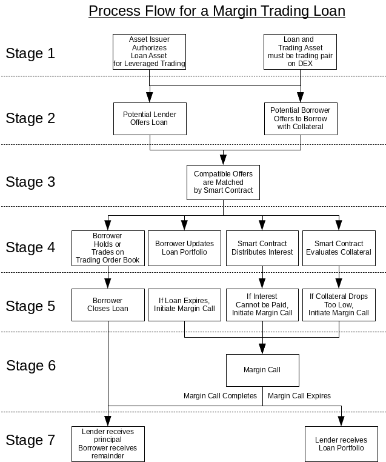

    BSIP: 70
    Title: Peer-to-Peer Leveraged Trading
    Authors: George Harrap, Michel Santos, Peter Conrad
    Status: Draft
    Type: Protocol
    Created: 2019-06-17
    Discussion: https://github.com/bitshares/bsips/issues/170

# Abstract

This BSIP defines a protocol upgrade in order to support peer-to-peer lending, borrowing and margin trading markets on the BitShares DEX. Lending is defined as any user of the BitShares DEX having the ability to post an offer to lend _any_ BitShares asset they own to a market where a borrower may take that offer (by posting collateral) and pay the lender a lender-defined amount of interest over a time period.

The Borrower may choose to take the offer or post their preferred borrowing interest rate as a Bid and when taken, execute an exchange transaction with that token for another specified by the lender. The borrower will pay the lender interest _in the asset type that was borrowed_.  Should the value of their margin position fall by a specified amount, the borrowers' balance will be margin called and sold on the market to payback the debt to the lender. The borrower risks losing their collateral in the case of a margin call and the lender risks the orderbook depth being insufficient to pay back their loan in the specified market.

# 
 Motivation

BitShares is the longest running decentralised cryptocurrency exchange and one of the pioneers of collateralised stablecoins. While the BitShares DEX makes it easy to trade in an environment where users have custody of their own keys, there are opportunities to be made to improve liquidity, onboard new users and affect great trading activity on the BitShares DEX.

The highest volume and most liquid exchanges in the world to date like Bitmex and Bitfinex who rose to dominance due to their usage of leverage in catalysing greater liquidity for their customers.

With this in mind, some of the key inhibitors to growth right now for the BitShares DEX include:

_Incentive for Smartcoin creation / holding_: The growth in liquidity of Smartcoins like bitUSD, BitCNY, BitEUR and others depends on users locking up BTS collateral to create these assets. For users engaged in creating these assets they must often manage exposure to a highly volatile collateral asset and are not paid for taking on the risk which could reduce potential new issuance.

_Smartcoin Liquidity_: The most liquid BitShares markets are often the smart coin markets, however the liquidity of Smartcoins in circulation on the orderbook is not yet comparable to larger teir centralised exchanges thereby reducing potential usage of the BitShares DEX.

Counterparty risk of crypto lending: Currently one of the only ways with market traction to earn passive income on cryptocurrency holdings is to trust a centralised counterparty and give up ownership of your money to another entity. This is highly risky with users no longer in control of their funds and at risk of hacking or confiscation.

_BTS Price growth_: The Bitshares token (BTS) is the underlying collateral required for committee issued assets and therefore a higher Bitshares price incentivises greater Smartcoin creation. Growing demand for BitShares assets promotes higher collateralisation of BTS which requires more BTS being removed from circulation which over time reduces supply and can increase positive price pressure.

The motivation behind this BSIP is to address these concerns and increase user demand, liquidity and passive income opportunities for users of the BitShares DEX.

# 
 Rationale

This BSIP seeks to address the inhibitors to growth in the BitShares DEX by introducing P2P Lending, Borrowing and Margin trading markets on the BitShares DEX. This new functionality would address the above concerns as follows:

_Passive risk adjusted income_: Any user may choose to lend any BitShares asset for a user defined rate of return over a specified time period. This not only provides an added incentive to hold an asset that can return a yield but also ensures existing liquidity of BitShares assets is deployed to the trading orderbook.

_On-chain lending and borrowing reduces risk_: Users seeking a return would not need to trust third party intermediaries with their funds and can engage in lending and borrowing contracts on the BitShares DEX. This reduces risk compared to competing centralised non-custodial competitors.

_Increased DEX liquidity_: With the ability for users to lend new or existing liquidity directly to the orderbooks, it provides greater order book depth than exists currently. This reduces risk for margin traders who rely on ample orderbook depth to ensure their positions can be adequately executed at a desired price or in the case of margin calls greater depth reduces collateral losses.

_Long / Short any asset on the DEX_: A user could borrow or lend any asset on the DEX adding new opportunities to make money from market movements especially in bear markets. This also enables smartcoin issuers to hedge their BTS (or other) exposure which could assist these users maintain adequate MCR ratios thereby reducing global settlement risk.

_Added volume and usage of BTS_: Every operation on the BitShares DEX requires a fee to be paid which returns BTS to the reserve pool. Greater usage of the BitShares DEX increases fees paid, reduces supply which can result in a positive price pressure on BTS. Additionally new smartcoin issuance for committee assets and some private assets requires BTS as collateral and therefore increased issuance also requires the purchase and lock up of BTS, increasing demand of BTS.

The BitShares DAC is well situated to capture a market opportunity in this space with the core intent of this BSIP to increase the viability of the BitShares DEX as a high volume, non-custodial, transparent and liquid trading exchange.

# 
 Specifications

The process flow for margin trading is depicted below.  The process consists of seven stages with some stages containing parallel processes.

1. [Stage 1a](#process-authorized-leveraged-trading): Prior to any loan being offered or matched, the asset issuer must authorize the loan asset for lending for margin trading against sets of tradable assets.
1. [Stage 1b](#process-reference-price): Prior to any loan being offered or matched, it must be possible to look up a [_valid_ reference price](#reference-price-determination) between the tradable asset and the the loan asset on the internal DEX market.
2. [Stage 2](#process-loan-offers): Lenders and potential Borrowers can place offers on the _Lending Order Book_.  The offers by lenders ("loan offers") and the offers by borrowers ("borrow offers") shall remain on the books until they are canceled by the offeror, expire, or are completely matched by counter-offers.
3. [Stage 3](#process-loan-matching): Compatible offers are matched to create a loan.
4. [Stage 4a](#process-margin-trading): A borrower may hold the borrowed asset and/or trade against the agreed-upon tradable asset for the _duration of the loan_.  [Stage 4b](#process-interest-payment): The smart contract will transfer interest payments from the borrower's loan portfolio to the lender on a daily basis.  [Stage 4c](#process-loan-appraisal) The smart contract shall appraise the loan to check whether sufficient collateral backs the loan.  [Stage 4d](#process-portfolio-updating): A borrower may update the amount of collateral in their loan.
5. [Stage 5a](#process-loan-closure-initiation): _A borrower_ may initiate a loan closure any time prior to the loan expiry.  [Stage 5b](#process-loan-expiration): _The smart contract_ may initiate a margin call when the loan expires.  [Stage 5c](#process-margin-call-initiation-due-to-inability-to-pay-interest): _The smart contract_ may initiate a loan closure if it is unable to pay the daily interest on behalf of the borrower.  [Stage 5d](#process-margin-call-initiation): _The smart contract_ may initiate a loan  closure by margin call if it appraises the loan's collateral as being too low.
6. [Stage 6](#process-margin-call): During a margin call process the smart contract attempts to liquidate a [loan portfolio](#process-margin-trading) to obtain a [sufficient balance](#process-loan-closure) of the borrowed asset to repay the lender.  This might require selling the balance of the tradable asset on the market.
7. [Stage 7a](#process-loan-closure): During a loan closure, the lender is repaid what is [owed](#debt-owed) and any balance of assets that remain in the [loan portfolio](#process-margin-trading) are transferred to the borrower's regular set of balances.  [Stage 7b](#process-unconventional-loan-closure): Alternatively, if a [margin call](#process-margin-call) is initiated that does not complete within a certain amount of time, the [entire loan portfolio shall be confiscated from the borrower](#process-portfolio-confiscation) and [transferred to the lender](#process-unconventional-loan-closure) as a _substitute payment_ for what is owed.

## 
 Stage 1a: Authorized Leveraged Trading Pairs

The asset issuer _of the loan asset_ must authorize the loan asset to be used for lending for margin trading ("leveraged trading") against a set of tradable assets.  This set of authorized tradable asset may be updated by the asset issuer at any time.  These restrictions shall affect the [creation of new loan and borrow offers](#process-loan-offers).

## 
 Stage 1b: Reference Price

Knowledge of the exchange rate between the loan asset and the tradable asset is essential for the smart contract to automatically appraise a portfolio during the [loan appraissal](#process-loan-appraisal) and to evaluate the need for a possible [margin call](#process-margin-call-initiation).  This price shall be determined by the smart contract from data _on the decentralized exchange and not from any external price feeds_.  The reference price shall be [validated under specific rules](#reference-price-determination), and [prohibitions shall be imposed while the reference price is invalid](#prohibitions-under-invalid-reference-price).

### 
 Determination of Reference Price

The reference price for the tradable asset that is denominated in terms of the loan asset shall be updated every block that has any activity (new orders, canceled orders, and matched orders) in that market pair's trading book.  The reference price of the tradable asset shall be calculated according to the following rules.

|Asset|Reference Price|Validity of Reference Price|
|-|-|-|
|Tradable asset is a bitAsset that _is not_ in global settlement|The highest offer price for the tradable asset.  If there are no offers, the last traded price.|Valid if (a) there any offers for the tradable asset, and (b) if there has ever been any trade activity.|
|Tradable asset is a bitAsset that _is_ in global settlement|Global settlement price|Always valid|
|All other assets|The highest offer price for the tradable asset.  If there are no offers, the last traded price.|Valid if (a) there any offers for the tradable asset, and (b) if there has ever been any trade activity.|

If the validity conditions are not satisfied for the asset pair, the **reference price shall be considered invalid** and [certain activities shall be prohibited](#prohibitions-under-invalid-reference-price).

### 
 Prohibited Activity under Invalid Reference Price

A valid reference price permits the tradable asset [components of the portfolio](#portfolio-components) (Tliquid and Torders) to be appraised in terms of the loan asset.  This allows the entire loan portfolio to be appraised which further allows a check of [the minimum collateral requirements for an existing loan](#process-margin-call-initiation).

Therefore with a valid reference price

- loan offers may be [made](#process-loan-offers),
- loan offers may be [matched](#process-loan-matching),
- assets within a loan portfolio may be [traded](#process-margin-trading),
- a borrower may [deposit additional borrowed asset](#deposits),
- a borrower may [withdraw the tradable asset](#withdrawals) _subject to collateral requirements_,
- loan portfloios may be [closed by the borrower](#process-loan-closure-initiation),
- loan portfolios may be [closed by the smart contract due to the expiration](#process-loan-expiration), and
- loan portfolios may be [margin called](#process-margin-call-initiation) _subject to collateral requirements_.

However an _invalid_ reference price prevents a portfolio appraisal (except for the trivial case where the portfolio only consists of the borrowed asset components (Bliquid and Borders).  Without the ability to appraise the tradable asset portion of the portfolio, collateral requirements cannot be evaluated.  Therefore,

- loan offers **shall not** be _matched_ to prevent the creation of new loans,
- a borrower **shall not** be able to _sell_ more of the [borrowed asset](#borrow-asset) if the new liquid balance (Bliquidafter) shall become less than the minimum collateral value.  This constraint can be expressed as MCV &le; Bliquidafter.
	- The new limit order (Btradenew) is constrained such that 0 &lt; Btradenew &le; Bliquidbefore - MCV
- a borrower **shall not** be able to _sell_ more of the [tradable asset](#loan-offer-tradable-asset) if the new liquid balance (Bliquidafter) shall become less than the minimum collateral value.  This constraint can be expressed as MCV &le; Bliquidafter
	- The new limit order with a minimum to receive of the borrowed asset (Btradereceive) is constrained such that 0 &lt; Btradereceive &le; Bliquidbefore - MCV
- a borrower **shall not** be permitted to _withdraw_ the [tradable asset](#loan-offer-tradable-asset) unless the liquid balance of the borrowed asset (Bliquid) is greater than the maintenance collateral value (MCV).  This constraint can be expressed as MCV &le; Bliquid
- margin calls **shall not** be _[initiated](#process-margin-call-initiation)_ because the collateral ratio (CR) of the loan portfolio cannot be calculated.

## 
 Stage 2: Offers to Lend and Borrow

Both potential lenders and potential borrowers can place offers on the Loan Order Book.  Potential lenders place "loan offers" and potential borrowers place "borrow offers".  Loan offers contain the following parameters:

|Lending Offer Parameter|Description|
|-|-|
|
 Asset type to lend|The asset type that the lender is offering to lend |
|
 _Minimum_ amount to lend|The minimum amount of the loan asset type that will be lent into a matched loan.|
|
 _Maximum_ amount to lend|The maximum amount of the loan asset type that the lender is offering.  This amount is deducted from the lender's balances when the offer is created.|
|
 Asset type of collateral|The asset type that the borrower must provide as collateral.  _For this initial version of margin trading, this shall be the same asset type as the [asset type to lend](#loan-asset)._|
|
Maintenance collateral ratio (MCR)|The _minimum_ collateral ratio that the lender is expecting at the beginning of a loan.  MCR &ge; MCCR &ge; 1|
|
Margin call collateral ratio (MCCR)|The _minimum_ collateral ratio below which [a margin call of the loan is initiated](#process-margin-call-initiation).  MCR &ge; MCCR &ge; 1|
|
_Maximum_ duration of margin call|The _maximum_ duration of a [margin call](#process-margin-call), if one is necessary, after which a [portfolio confiscation](#process-portfolio-confiscation) will be triggered.|
|
 Asset type to trade against (Tradable asset)|The asset type that the lender permits the borrower to trade against.  This restriction protects the lender from exit scam trading.|
|
_Minimum_ duration of loan|The _minimum_ duration of the loan that the lender is willing to accept.|
|
_Maximum_ duration of loan|The _maximum_ duration of the loan that the lender is willing to accept|
|
Minimum interest rate|The _minimum_ daily interest rate that the lender is willing to accept|
|Expiration date|Expiration date of the offer|

Borrow offers contain the following parameters:

|Borrowing Offer Parameter|Description|
|-|-|
|
 Asset type to borrow|The asset type that the borrower is seeking|
|
_Minimum_ amount to borrow|The minimum amount of the loan asset type that will be borrowed into a matched loan.|
|
_Maximum_ amount to borrow|The maximum amount of the loan asset type that the borrower is willing to borrow.|
|Asset type as collateral|The asset type that the borrower must provide for collateral.  _For this initial version of margin trading, this shall be the same asset type as the asset type to lend._|
|Amount of collateral|The amount of collateral the borrower has put into the offer.  This amount is deducted from the borrower's balances when the offer is created.|
|
Maintenance collateral ratio (MCR)|The _maximum_ collateral ratio that the borrower is willing to offer at the beginning of a loan.  MCR &ge; MCCR &ge; 1|
|
Margin call collateral ratio (MCCR)|The _maximum_ collateral ratio below which [a margin call of the loan is initiated](#process-margin-call-initiation).  MCR &ge; MCCR &ge; 1|
|
_Minimum_ duration of margin call protection|The _minimum_ duration of a [margin call](#process-margin-call), if one is necessary, after which a [portfolio confiscation](#process-portfolio-confiscation) will be triggered.|
|
 Asset type to trade against (Tradable asset)|The asset type that the borrower can trade against.|
|
_Minimum_ duration of loan|The _minimum_ duration of the loan that the borrower is willing to accept.|
|
_Maximum_ duration of loan|The _maximum_ duration of the loan that the borrower is willing to accept|
|
_Maximum_ interest rate|The _maximum_ daily interest rate that the borrower is willing to accept|
|Expiration date|Expiration date of the offer|

After an offer is created, all users shall be able to identify:
- which unmatched offers are on the Lending Order Book, and
- which offers are matched.

Users shall have the ability to filter offers either by type (loan offer or borrow offer), asset type to loan, tradable asset type, amounts, interest rate, loan duration, maintenance collateral ratio, and margin call collateral ratio.  This capability shall either be done at the Core RPC-API node and/or at the user interface.  Offers to lend and offers to borrow shall have unique identifiers which can be referenced for [loan matching](#process-loan-matching).

The creation of offers, their partial and complete matches, their expiration, and their closures, shall be recorded as part of the account history of the lender and the borrower.

Offers to lend and borrow shall remain on the Loan Order Book until they either are canceled by the offeror, expire, or are completely [matched and filled](#offer-filling).

## 
 Stage 3: Loan Offer Matching

New offers shall be automatically compared to existing counter-offers on the book.  This matchmaking investigation shall:

1. [identify compatible offers](#automatic-matching-compatibility-filtering)
2. [match compatible offers](#automatic-matching-offer-selection)
3. [create a loan from the matched offers](#automatic-matching-loan-creation)

### 
 Compatibility Filtering

This matchmaking process shall only match a loan offer (L) with a borrow offer (B) if those offers have the following compatible conditions.

|Offer Parameter|Compatibility Conditions|
|-|-|
|Loan amount (P)|[LPmin](#loan-offer-minimum-amount) &le; [BPmax](#borrow-offer-maximum-amount) and [BPmin](#borrow-offer-minimum-amount) &le; [LPmax](#loan-offer-maximum-amount)|
|Loan duration (D)|[LDmin](#loan-offer-minimum-amount) &le; [BDmax](#borrow-offer-maximum-amount) and [BDmin](#borrow-offer-minimum-amount) &le; [LDmax](#loan-offer-maximum-amount)|
|Interest rate (I)|[LI](#loan-offer-interest-rate) &le; [BI](#borrow-offer-interest-rate)|
|Minimum collateral ratio (MCR)|[LMCR](#loan-offer-maintenance-collateral-ratio) &le; [BMCR](#borrow-offer-maintenance-collateral-ratio)|
|Margin call collateral ratio (MCCR)|[LMCCR](#loan-offer-margin-call-collateral-ratio) &le; [BMCCR](#borrow-offer-margin-call-collateral-ratio)|
|Margin call duration (MCD)|[BMCD](#borrow-offer-margin-call-duration) &le; [LMCD](#loan-offer-margin-call-duration)|

Therefore when a _new_ loan offer or borrow offer is received, it shall be checked against the _existing_ offers.  This new offer will become the "taker" to the existing "maker" offers.  The outcome of this investigation may identify _multiple_ "maker" offers to be compatible with the new "taker" offer.

If no compatible offers are found for the new offer, the new offer shall be added to the offer order book and retained until it is canceled, expires, or is completely [matched and filled](#offer-filling).

### 
 Offer Matching

When multiple loan offers (L) are found to be compatible with multiple borrow offers (B), they shall be prioritized in a deterministic manner to identify which of the compatible offers will be matched to each other.

As the definition of most offer parameters are not exact values (e.g. a lender might offer a loan for exactly 6 months) but are rather bounded values (e.g. a lender might offer a loan for a duration between 3 months and 12 months), and the compatibility conditions permit a range of overlap between a loan offer and a borrow offer, there may mathematically be an _infinite number_ of loan definitions that _could be created_ from even a single loan offer and borrow offer.  (Technically the number of loan offers are finite because they will only be characterized by finite-precision integer parameters.)  _**Matches shall be made to favor the existing offers on the loan offer books (the "makers")**._

If the new offer (the "taker") is a borrow offer, the compatible loan offers shall be sorted in favor of the lenders (the "makers").  These compatible offers shall be sorted in favor of the lender offers as described in the following table.

|Loan Parameter|Loan Parameter Selection|Loan Parameter Value|Prioritization Order|
|-|-|-|-|
|Interest rate (I)|_Highest_ compatible interest rate|[BI](#borrow-offer-interest-rate)|1|
|Loan duration (D)|_Longest_ compatible loan duration|min([LDmax](#loan-offer-maximum-duration), [BDmax](#borrow-offer-maximum-duration))|2|
|Loan amount (P)|_Largest_ compatible amount|min([LPmax](#loan-offer-maximum-amount), [BPmax](#borrow-offer-maximum-amount))|3|
|Margin call collateral ratio (MCCR)|_Highest_ compatible MCCR|[BMCCR](#borrow-offer-margin-call-collateral-ratio)|4|
|Minimum collateral ratio (MCR)|_Highest_ compatible MCR|[BMCR](#borrow-offer-maintenance-collateral-ratio)|5|
|Margin call duration (MCD)|_Shortest_ MCD|[BMCD](#borrow-offer-margin-call-duration)|6|

If the new offer (the "taker") is a loan offer, the compatible offers shall be sorted in favor of the borrowers (the "makers").  These compatible offers shall be prioritized favor of the borrower offers as described in the following table.

|Loan Parameter|Loan Parameter Selection|Loan Parameter Value|Prioritization Order|
|-|-|-|-|
|Interest rate (I)|_Lowest_ compatible interest rate|[LI](#loan-offer-interest-rate)|1|
|Loan amount (P)|_Largest_ compatible amount|min([LPmax](#loan-offer-maximum-amount), [BPmax](#borrow-offer-maximum-amount))|2|
|Loan duration (D)|_Longest_ compatible loan duration|min([LDmax](#loan-offer-maximum-duration), [BDmax](#borrow-offer-maximum-duration))|3|
|Margin call collateral ratio (MCCR)|_Lowest_ compatible MCCR|[LMCCR](#loan-offer-margin-call-collateral-ratio)|4|
|Minimum collateral ratio (MCR)|_Lowest_ compatible MCR|[LMCR](#loan-offer-maintenance-collateral-ratio)|5|
|Margin call duration (MCD)|_Longest_ MCD|[LMCD](#loan-offer-margin-call-duration)|6|

The highest prioritized maker offer shall be paired to the new offer and a new loan shall be created in accordance with the loan parameter values in the corresponding table.

### 
 Loan Creation

The matching of a loan offer with a borrow offer shall result in the creation of a loan.

This new loan portfolio shall receive the loan amount (P) from the lending offer and an amount of collateral asset (K) from the borrowing offer equal to

K = (MCR - 1) &times; P

_A loan shall be created from a single lending offer and a single borrowing offer._

This loan portfolio shall then become available for [margin trading by the borrower](#process-margin-trading).

#### 
 Effective Dates of the Loan

The start date of the loan shall be when the loan is matched.  The _earliest end date_ of the loan shall be calculated by adding the minimum loan duration, that is compatible with the matched [loan offer](#loan-offer-minimum-duration) and [borrow offer](#borrow-offer-minimum-duration), to the start date.  The _latest end date_ of the loan shall be calculated by adding the maximum loan duration, that is compatible with the matched [loan offer](#loan-offer-maximum-duration) and [borrow offer](#borrow-offer-maximum-duration), to the start date.  The loan may be closed:

- [by the borrower](#process-loan-closure) on or after the _earliest_ end date and before the _latest_ end date,
- [by the smart contract when the _latest_ end date arrives](#process-loan-expiration), or
- [by the smart contract any time before the _latest_ end date if the loan portfolio is undervalued](#process-margin-call-initiation).

#### 
 Filling of Loan Offer

The matching of a loan offer with a borrow offer will result in one or both of the offers being completely consumed.  If an offer is not completely filled, the _offer shall be "partially filled" by having the loan amount (P) deducted from the offer's "available balance"_.

##### Effects of Partial Fills on a Loan Offer

The reduction to a _loan offer_ reduces the amount that has been offered by the prospective lender.

(BPmax)new = (BPmax)old - P

If this remainder exceeds the loan offer's [minimum amount](#loan-offer-minimum-amount) (BPmin), the loan offer shall be retained on the offer books.  Otherwise the offer shall be cancelled by the smart contract.

##### Effects of Partial Fills on a Borrow Offer

The reduction to a _borrow offer_ reduces the amount of collateral (K) that is being offered by the prospective borrower.

Knew = Kold - P

This effectively reduces the [maximum loan amount](#borrow-offer-maximum-amount) of the borrow offer.

(LPmax)new = Knew &div; (MCR - 1) = (Kold - P) &div; (MCR - 1)

If this remainder exceeds the borrow offer's [minimum amount](#borrow-offer-minimum-amount) (LPmin), the loan offer shall be retained on the offer books.  Otherwise the offer shall be cancelled by the smart contract.

##### Re-evaluation of a New Offer

If the partially-filled offer is retained _and_ if the partially filled offer is _the new offer_, it shall be re-evaluated for loan matching against the remaining counter-offers.

## 
 Stage 4a: Margin Trading within Loan Portfolio

Assets that are borrowed shall be placed into the borrower's margin trading "loan portfolio".  _This portfolio shall only be used for trading on the decentralized exchange in the market pair consisting of the ["Asset type to lend/borrow"](#loan-asset) and the ["Asset type to trade against"](#loan-offer-tradable-asset).  It shall not be possible to transfer funds to any account, nor use any of the assets as collateral to create another pegged asset on BitShares._

Any assets obtained from trading shall by placed into the loan portfolio and shall also be restricted to trading between the pair of asset types defined in the loan agreement.  [Conditional withdrawals of the tradable asset](#withdrawals) by the borrower shall be permitted.  [Deposit of the lent asset](#deposits) by the borrower shall also be permitted.

### 
 Trading Limits

A borrower shall be able to use the [borrowed asset type](#borrow-asset) in the loan portfolio to trade against the tradable asset on the order book of the market pair.  _The amount_ of the borrowed asset type (B) that may be used for placing new orders shall be limited to ensure that the loan portfolio's _balance of the borrowed asset_ exceeds the [minimum collateral](#initial-collateral) (K).  Before a trade the liquid balance of the asset type is Bliquidbefore.  The liquid balance of the asset type after a new order (Btradenew) can be calculated as

Bliquidafter = Bliquidbefore - Btradenew

The new liquid balance must satisfy the following condition and [definition for collateral](#initial-collateral)

Bliquidafter &ge; K = (MCR - 1) &times; B0

which can be re-arranged as

Btradenew &le; Bliquidbefore - (MCR - 1) &times; B0

This expresses a maximum amount for any new limit orders where the borrowed asset is offered to trade.  If this amount is negative, no new trades shall be permitted.

### 
 Multiple Loan Portfolios

A borrower may have multiple outstanding loans each with their own distinct loan portfolio.  Trading of assets from each loan portfolio shall be independent of other loan portfolios that are controlled by the borrower.  Trade orders shall only draw from assets within a single loan portfolio.

The distinction of loan portfolios from each other are intended to segregate the risk of each loan which can have separate loan durations, margin collateral ratios, and tradable assets.  This segregation should better secure the lenders than a single co-mingled loan portfolio.

User interfaces that facilitate trading for a borrower may optionally aggregate multiple loan portfolios into a single "margin trading wallet" to disguise the fact that multiple loan portfolios are being tracked.

## 
 Stage 4b: Daily Interest Payment

The daily interest due (Idaily) on the prinicipal (B0) shall be calculated as

Idaily = B0 &times; Rdaily

where Rdaily is daily interest rate.  This daily interest shall be calculated _in terms of the lent asset type_.

The daily interest that is due shall be deducted from the borrower's balance of the [borrowed asset type](#borrow-asset) in the loan portfolio and deposited into the lender's account.  If the borrower's loan portfolio holds insufficient balance of the lent asset type to pay the daily interest then [a margin call shall be initiated](#process-margin-call-initiations).

When a [loan is closed](#process-loan-closure) the interest for that last day shall be paid at that time.  _If a margin call requires multiple days to complete in accordance with the agreed [duration of the margin call's loan](#loan-offer-margin-call-duration), no additional interest shall be owed by the lender beyond payment for the last day of interest._

## 
 Stage 4c: Appraisal of Loan Portfolio

### 
 Debt Owed

The debt owed by a borrower for a particular loan is the amount lent by the lender.  [Interest is due on a daily basis](#process-interest-payment).

### 
 Portfolio Appraisal

A borrower may have many outstanding loans which are owed to different borrowers.  Each [loan portfolio](#process-margin-trading) will _initially_ consist of the principal that is lent by the lender plus the initial collateral that is provided by the borrower.  The borrowed asset and the collateral asset shall initially be the same asset type (B).

After the loan is initiated, the borrower may use that asset type to trade against the tradable asset type (T) that is permitted by the loan, and/or may hold the borrowed asset.  Therefore this loan-related portfolio may consist of balances of two asset types: the [borrowed asset type](#borrowed-asset), and the [tradable asset type](#loan-offer-tradable-asset).

PA  = B + T

#### 
 Portfolio Components

While a loan is outstanding the balance of the borrowed asset and tradable asset may consist as either liquid balances in the loan portfolio or as open orders on the order book.  Therefore the entire loan portfolio may be decomposed into four parts:

- a balance of borrowed asset that is liquid (Bliquid)
- a balance of tradable asset that is liquid (Tliquid)
- a balance of borrowed asset that is in open order (Borders)
- a balance of tradable asset that is in open order (Torders)

PA  = Bliquid + Tliquid + Borders + Tliquid

The valuation of the portfolio shall also be denominated in terms of the borrowed asset type for purposes of appraisal by the smart contract.  The valuation of the borrower's loan-related portfolio shall consist of the valuation of the two assets in the portfolio at the time of interest.

- The valuation of the liquid balance and order balance of the borrowed asset shall simply be their sum.
- The valuation of the liquid balance and order of the tradable asset _shall be denominated in the borrowed asset type_ by the smart contract with the use of [reference price](#process-reference-price).

---

<b>Example of Portfolio Appraisal</b>

Bob borrowed 70 bitUSD 203.3 days ago while supplying by supplying 30.03 bitUSD as collateral.  Bob has been margin trading with this loan portfolio against bitBTC and currently has a balance of 45 bitUSD and 0.025 bitBTC.  The current reference price indicates that bitBTC is priced at 5000 bitUSD per bitBTC.  This loan portfolio will be appraised (PA) at:

PA = (45 bitUSD) + (0.025 bitBTC &times; 5000 bitUSD &div; bitBTC)

... = (45 bitUSD) + (125 bitUSD)

... = 170 bitUSD

---

### 
 Collateral Ratio

After [the calculation](#appraisal-triggers) of a [portfolio appraisal](#portfolio-appraisal) (PA) and the [debt owed](#debt-owed) (B0), the collateral ratio (CR) shall be calculated as

CR = PA &div; B0

At the beginning of the loan, the collateral ratio will satisfy the following conditions.

CR &ge; MCR &ge; MCCR &ge; 1

### 
 Derived Valuations

The maintenance collateral valuation (MCV) of the loan portfolio is denominated in the [borrowed asset](#borrow-asset) and equals

MCV = MCR &times; B0

where B0 is the [debt owed](#debt-owed).

Similarly, the margin call collateral valuation (MCCV) of the loan portfolio is denominated in the [lent asset](#loan-asset) and equals

MCCV = MCCR &times; B0

It is desired for the [appraised valuation of the portfolio](#portfolio-appraisal) (PA) to be greater than or equal this value

PA &ge; MCV &ge; MCCV &ge; B0

but it is possible for this valuation to fall below the MCV.  If

PA &lt; MCCV

a [margin call shall be initiated](#process-margin-call-initiation).

### 
 Triggering of Appraisal

Portfolio appraisals shall be triggered at multiple times.  A portfolio appraisal shall be triggered:

- _before_ any new portfolio trade is executed to calculate the current [trading limit](#trading-limit),
- _after_ a [loan portfolio is updated](#process-portfolio-updating) by the borrower,
- _after_ a margin trade order is filled, and
- _after_ [interest is paid](#process-interest-payment).

## 
 Stage 4d: Loan Portfolio Updates

### Status of Loan Portfolio

The "recent" [appraisal value](#portfolio-appraisal), [debt owed](#debt-owed), [collateral ratio](#collateral-ratio), and [derived valuations](#derived-valuations), and of the portfolio shall be able to be queried by the lender and borrower at any time.

### 
 Deposits

A borrower shall be able to deposit additional amounts of the [borrowed asset](#borrow-asset) into the loan portfolio.  A borrower may choose to deposit additional collateral to avoid having the [loan be margin called](#process-margin-call-initiation).

### 
 Withdrawals

A borrower shall be able to withdraw **only the tradable asset** as long as _the market valuation of the portfolio (PA) **after the withdrawal** is greater than or equal to the [maintenance collateral valuation](#derived-valuations)_.  The withdrawal limit (Wlimit) is defined as

Wlimit = PA - MCV

where MCV is [maintenance collateral valuation](#derived-valuations) and PA is [portfolio appraisal](#portfolio-appraisal).

---

<b>Example of Withdrawal</b>

Bob borrowed 70 bitUSD 203 days ago at a daily interest rate of 0.0261% while supplying by supplying 30.03 bitUSD as collateral to satisfy the offer's 142.9% maintainance collateral ratio.

The debt owed is still 70 bitUSD.  The [maintenance collateral valuation](#derived-valuations) (MCV) of the portfolio is

MCV = MCR &times; B0

... = 1.429 &times; 73.8276 bitUSD

... = 105.4996 bitUSD

During this time Bob has been margin trading with this loan portfolio against bitBTC and currently has a balance of 45 bitUSD and 0.025 bitBTC.  The current reference price indicate that bitBTC is priced at 5000 bitUSD per bitBTC.  This loan portfolio will be appraised at:

PA = (45 bitUSD) + (0.025 bitBTC &times; 5000 bitUSD &div; bitBTC)

... = (45 bitUSD) + (125 bitUSD)

... = 170 bitUSD

The borrower may withdraw up to _the equivalent_ (Wlimit) of

Wlimit = PA - MCV

... = 170 bitUSD equivalent - 105.4996 bitUSD equivalent

... = 64.5004 bitUSD equivalent

The withdrawal limit denominated in bitBTC is

Wlimit = (64.5004 bitUSD &div; (5000 bitUSD &div; bitBTC))

... = 0.01291 bitBTC

Bob may withdraw bitBTC up to this limit because the balance of bitBTC, 0.025, exceeds this amount.  If the balance of the tradable asset were, for example, only 0.1 bitBTC then Bob would only be able to withdraw 0.1 bitBTC.

---

## 
 Stage 5a: Initiation of Loan Closure by Borrower

A borrower may close an outstanding loan position _any time between [the earliest end date and the latest end date](#loan-duration)_ by having a [sufficient balance of the borrowed asset type](#process-loan-closure) in the loan portfolio and then initiating a loan closure with the appropriate parameters.

|Initiation of Loan Closure Parameter|Description|
|-|-|
|Lending Offer ID|Identifier of an existing and open loan offer|

The initiation of a loan closure shall close any and all open trade orders that are related to this loan.  If the balance of the borrowed asset type is insufficient to repay what is owed then the initiation of the loan closure shall be rejected.  _It is the responsibility of the borrower to ensure a [sufficient balance](#process-loan-closure) in the borrowed asset type to repay the loan._

## 
 Stage 5b: Expiration of Loan

The smart contract shall initiate a [margin call](#process-margin-call) if an outstanding loan [expires](#loan-duration).

A future BSIP may consider opening a new loan from any existing offers on the Loan Order Book.

## 
 Stage 5c: Initiation of Loan Closure because of Insufficient Funds

A loan portfolio may categorized as consisting of [four components of balances](#portfolio-components) of which one is the balance of borrowed asset that is liquid (Bliquid).  This balance is drawn from to pay the daily interest.  If this balance is insufficient to pay the interest then a loan closure shall be initiated.

## 
 Stage 5d: Initiation of Loan Closure by Margin Call

If the [collateral ratio](#collateral-ratio) ever drops below the margin call collateral ratio,

CR &lt; MCCR

the smart contract shall initiate a [margin call](#process-margin-call).

## 
 Stage 6: Margin Call

### Restriction of Loan Portfolio

When a margin call is initiated on a specific loan portfolio, no new market orders may be initiated that make use of any balance in the loan portfolio.  _Any other loan portfolios that the borrower might have shall not be affected by margin calls on other loans._

Any open market orders that are related to that specific loan portfolio shall be cancelled.

After all open orders are cancelled, the portfolio will consist of some amount in the borrowed asset type and some amount in the tradable asset type.

PA = Bliquid + Tliquid

### 
 Liquidation Plan

The smart contract shall determine whether the balance of the [borrowed asset](#borrowed-asset) (Bliquid) is sufficient to pay the [necessary balance](#process-loan-closure) (Bclosure).  The difference between the two is the excess borrowed asset (Bexcess)

Bexcess = Bliquid - Bclosure

If the balance is sufficient (Bexcess &gt; 0), the process shall transition to a [conventional loan closure](#process-loan-closure).

If the balance is insufficient (Bexcess &lt; 0), the smart contract shall create a limit order that offers the entire balance of the tradable asset (T) while asking for the difference between what is owed and the liquid balance(-Bexcess).  This limit order shall have a limited lifetime defined by the [maximum margin call duration](#loan-offer-margin-call-duration) that was agreed to in the original loan terms.

If the margin call's limit order is filled, then by definition of the limit order there shall be sufficient balance of the borrowed asset type to transition to a [conventional loan closure](#process-loan-closure).

#### 
 Portfolio Confiscation

If the margin call's limit order expires without being completely filled, a [portfolio confiscation](#process-portfolio-confiscation) shall be automatically initiated to permit the prompt completion of the margin call.  _The smart contract shall confiscate the entire loan portfolio from the borrower for ultimate transfer to the lender._

### Monitoring of Liquidation Plan

It shall be possible to monitor the status of the liquidation plan associated with any margin call.  An inquiry into the status of the liquidation plan shall return:

- how much of the [tradable asset](#loan-offer-tradable-asset) was originally being liquidated,
- how much of the [tradable asset](#loan-offer-tradable-asset) has been sold, and
- how much of the [borrowed asset](#borrowed-asset) has been obtained as a result of the liquidation.

## 
 Stage 7a: Conventional Loan Closure

A standard loan closure is possible _if and only if_ the loan portfolio's balance of the borrowed asset type (Bliquid) is sufficient to repay [the principal](#debt-owed) plus [interest for the last day of the loan](#process-interest-payment).

Bclosure = B0 + Idaily

If that condition is satisfied, a standard loan closure can be:

- [initiated by the borrower](#process-loan-closure-initiation)
- [initiated by expiration of the loan](#process-loan-expiration)
- [initiated by the full completion of a margin call](#process-margin-call)

Any balances that remain in the loan portfolio after repaying the lender shall be transferred to the borrower's regular set of balances and shall no longer be encumbered by any restrictions.

A future BSIP may consider re-lending a lenders balance by automatically creating a new offer on the Loan Order Book on behalf of the lender.

**The loan shall be closed.**

## 
 Stage 7b: Unconventional Loan Closure

If a margin call's [liquidation plan](#liquidation-plan) expires without obtaining a [sufficient balance](#process-loan-closure) of the [borrowed asset](#borrow-asset) to repay the lender, the [confiscated loan portfolio](#process-portfolio-confiscation) shall be transferred to the lender as a _substitute payment_ for the debt.

**The loan shall be closed.**

## 
 Definable Loan Constraints

The BitShares Committee shall be able to define parameters that can constrain _new_ loans; changes to these values shall not affect _loans that were **offered**_ before the change:

|Term|Description|
|-|-|
|Maximum loan durations|The maximum duration for a new loan offer|
|Minimum MCR|The minimum maintenance collateral ratio (MCR) that may be agreed upon|
|Minimum MCCR|The minimum margin call collateral ratio (MCCR) that may be agreed upon|
|Maximum interest rates|The maximum interest rate that may be agreed upon|
|
 Maximum duration of margin call|The duration during which a borrower's loan portfolio shall be protected from [confiscation](#process-portfolio-confiscation).|

### 
 Fees

Fees shall be defined for each of the operations:

- creation of a lend offer
- creation of a borrow offer
- canceling an open offer
- depositing additional collateral
- withdrawing assets from a loan portfolio
- closing a loan
- placing trade orders from the loan portfolio
	- Placing orders from the margin account incurs [a computational burden on the nodes because of the need to ensure adequate collateralization of each loan portfolio](#appraisal-triggers).  This expense should be reflected in some fee related to loan portfolio operations.  A natural fit is to charge a higher fee for placing fees from a margin account.

The standard fee for canceling a trade order shall apply.

## 
 Voting Stake

Voting stake shall be calculated per account as before this proposal and with the following additions to account for any core tokens (BTS) that are associated with lending.

- Any balance of BTS in a lending offer shall be staked to the owner of the offer.
- Any balance of BTS in a borrowing offer shall be staked to the owner of the offer.
- If BTS is the [tradable asset](#loan-offer-tradable-asset) in a loan portfolio, the liquid balance (Tliquid) and the balance in open orders (Torders) shall be staked to the borrower.
- If BTS is the [borrowed asset](#borrow-asset) in a loan portfolio, the liquid balance (Bliquid) and the balance in open orders (Borders) shall be staked to the lender **up to the principal amount that is [lent](#loan-asset) (B0)**.  Any balance in excess of the principal shall be staked to the borrower.
	- The motivation for this segregation of voting stake is to prevent the renting of voting stake through this lending mechanism.

## 
 Software Specifications

**Note 1:** Interest is paid every 24 hours, regardless of local calendar. E. g. Daylight Savings Time is ignored.

**Note 2:** Percentage-based calculations (interest, CR) are always rounded up to the next possible value (aka "satoshi").

**Note 3:** MCR and MCCR are expressed in the same way as in the existing price feed logic, i. e. only the part above 100%, and as a scaled percentage value. E. g. a value of `4200` would mean `142%`.

**Note 4:** "Implementation hints" are not to be considered part of the formal specification, but merely as a *possible* implementation.

### Database Objects

#### `loan_offer_object` (new)

**Fields:**

* `loan_offer_id_type id` - The object ID
* `account_id_type owner` - The lending account ID
* `asset_id_type loan_asset` - The asset type that the lender is offering to lend
* `share_type min_amount` - The minimum amount of the asset type that the borrower must borrow
* `share_type max_amount` - The maximum amount of the asset type that the lender is offering
* `unsigned_int mcr` - The minimum collateral ratio that the lender is expecting at the beginning of a loan, as a scaled percentage
* `unsigned_int mccr` - The collateral ratio below which a margin call of the loan is initiated, as a scaled percentage
* `unsigned_int max_call_duration` - The maximum duration of a margin call in seconds, if one is necessary, after which a portfolio confiscation will be triggered
* `asset_id_type tradable_asset` - The asset type that the lender permits the borrower to trade against
* `unsigned_int min_duration` - The minimum duration of the loan that the lender is willing to accept, in days
* `unsigned_int max_duration` - The maximum duration of the loan that the lender is willing to accept, in days
* `unsigned_int min_interest_rate` - The minimum daily interest rate that the lender is willing to accept, as a scaled percentage
* `time_point_sec expiration` - Expiration date of the offer

**Implementation hints:**

* Indexed `by_owner`, `by_asset`, `by_expiration`
* Secondary index for tracking core per account

#### `borrow_offer_object` (new)

**Fields:**

* `borrow_offer_id_type id` - The object ID
* `account_id_type owner` - The borrowing account ID
* `asset_id_type loan_asset` - The asset type that the borrower is offering to borrow
* `share_type min_amount` - The minimum amount of the asset type that the lender must lend
* `share_type max_amount` - The maximum amount of the asset type that the borrower wants to borrow
* `share_type available_collateral` - The amount of collateral the borrower has put into the offer
* `unsigned_int mcr` - The maximum collateral ratio that the borrower is willing to provide at the beginning of the loan, as a scaled percentage
* `unsigned_int mccr` - The maximum collateral ratio the borrower will accept, below which a margin call of the loan is initiated, as a scaled percentage
* `unsigned_int min_call_duration` - The minimum duration of a margin call in seconds, if one is necessary, after which a portfolio confiscation will be triggered
* `asset_id_type tradable_asset` - The asset type that the borrower wants to trade against
* `unsigned_int min_duration` - The minimum duration of the loan that the borrower is willing to accept, in days
* `unsigned_int max_duration` - The maximum duration of the loan that the borrower is willing to accept, in days
* `unsigned_int max_interest_rate` - The maximum daily interest rate that the borrower is willing to accept, as a scaled percentage
* `time_point_sec expiration` - Expiration date of the offer

**Implementation hints:**

* Indexed `by_owner`, `by_asset`, `by_expiration`
* Secondary index for tracking core per account

#### `loan_portfolio_object` (new)

**Fields:**

* `account_id_type owner` - The borrowing account ID
* `account_id_type lender` - The lending account ID
* `asset_id_type principal_asset` - The ID of the borrowed asset
* `share_type principal_borrowed` - The amount that was originally borrowed
* `share_type minimum_collateral` - The minimum amount of collateral that must be maintained
* `share_type principal_balance` - The amount of the borrowed asset currently held in the portfolio
* `share_type principal_in_orders` - The amount of the borrowed asset currently held in market orders
* `asset_id_type trade_asset` - The ID of the asset that can be traded against
* `share_type trade_balance` - The amount of the tradable asset currently held in the portfolio
* `share_type trade_in_orders` - The amount of the tradable asset currently held in market orders
* `share_type mccv` - The portfolio value below which a margin call of the loan is initiated, in terms of `principal_asset`
* `unsigned_int call_duration` - The duration of a margin call in seconds, if one is necessary, after which a portfolio confiscation will be triggered
* `optional<time_point_sec> confiscation_time` - After a margin call has been initiated, this contains the time when the portfolio will be confiscated
* `share_type daily_interest` - The daily interest amount to be paid
* `time_point_sec interest_due_at` - Date at which the next interest payment is due
* `share_type cumulative_interest` - The cumulative interest paid for this loan so far
* `time_point_sec earliest_end` - Date after which the portfolio can be closed by the borrower
* `time_point_sec latest_end` - Date after which the portfolio will be closed automatically
* `optional<price> call_price` - If present, contains the price (in terms of principal/trade) below which the portfolio is margin called

**Implementation hints:**

* Indexed `by_owner`, `by_lender`, `by_interest_due`, `by_expiration` (i. e. `latest_end`)
* Secondary index for tracking core per account

#### `loan_market_dynamic_data_object` (new)

This contains entries only for asset pairs that are whitelisted for margin trading or have open loans.

**Fields:**

* `price last_price` - the most recent trade price of the pair, `base.asset_id < quote.asset_id`
* `unsigned_int loans` - the total number of open loans in either pair
* `bool base_lending_allowed` - true if lending of base asset for trading against quote asset is allowed
* `bool quote_lending_allowed` - true if lending of quote asset for trading against base asset is allowed

#### Chain parameters

The `chain_parameters` (configurable by committee) will receive a new extension field `margin_lending` with these members:

* `unsigned_int max_duration` - maximum allowed loan duration in days
* `unsigned_int minimum_mcr` - minimum allowed mcr for loans, as a scaled percentage
* `unsigned_int minimum_mccr` - minimum allowed mccr for loans, as a scaled percentage
* `unsigned_int max_interest` - maximum allowed daily interest rate, as a scaled percentage
* `unsigned_int max_call_duration` - maximum allowed call duration in seconds

This extension must not be present in proposals before the hardfork time.

#### Miscellaneous

* `limit_order_object` receives a new field `optional<loan_portfolio_id_type> loan`
* `additional_asset_options` receives a new extension `optional<flat_set<asset_id_type>> whitelist_margin_trading` (see below)

**Implementation hints:**

* Secondary index on `limit_order_object` for tracking `by_loan`

### Operations

All new operations have a simple flat fee.
New operations must not be allowed before the hardfork time, neither in proposals nor directly.
New fees must not be allowed in chain parameter update proposals before the hardfork.

#### `loan_offer_create_operation` (new)

**Fields:**

* `account_id_type lender` - The lending account ID
* `asset_id_type asset_to_lend` - The asset type that the lender is offering to lend
* `share_type min_to_lend` - The minimum amount of the asset type that the borrower must borrow
* `share_type max_to_lend` - The maximum amount of the asset type that the lender is offering
* `unsigned_int mcr` - The minimum collateral ratio that the lender is expecting at the beginning of a loan, as a scaled percentage
* `unsigned_int mccr` - The collateral ratio below which a margin call of the loan is initiated, as a scaled percentage
* `unsigned_int max_call_duration` - The maximum duration of a margin call in seconds, if one is necessary, after which a portfolio confiscation will be triggered
* `asset_id_type tradable_asset` - The asset type that the lender permits the borrower to trade against
* `unsigned_int min_duration` - The minimum duration of the loan that the lender is willing to accept, in days
* `unsigned_int max_duration` - The maximum duration of the loan that the lender is willing to accept, in days
* `unsigned_int min_interest_rate` - The minimum daily interest rate that the lender is willing to accept, as a scaled percentage
* `time_point_sec expiration` - Expiration date of the offer
* `extension_type ext` - reserved for future extensions

**Validation checks:**

* `lender` must be a valid account ID, must exist, must authorize the operation, must pay fee
* `asset_to_lend` and `tradable_asset` must be valid asset IDs, must not be equal, and both assets must exist
* `min_to_lend > 0`
* `max_to_lend >= min_to_lend`
* `mcr >= mccr`
* `max_duration >= min_duration`
* `expiration > head_block_time`
* `min_duration <= chain_parameters.max_duration`
* `mcr >= chain_parameters.min_mcr`
* `mccr >= chain_parameters.min_mccr`
* `min_interest_rate <= chain_parameters.max_interest_rate`
* `max_call_duration <= chain_parameters.max_call_duration`
* `lender` must have at least `max_to_lend` of `asset_to_lend` in his balance
* A `loan_market_dynamic_data_object` must exist for the `asset_to_lend`/`tradable_asset` pair
    * `asset_to_lend` must be [authorized for margin lending](#process-authorized-leveraged-trading) against `tradable_asset`
    * `last_price` must be valid
* `asset_to_lend` must be whitelisted or not blacklisted for trading against `tradable_asset` and vice versa
* `asset_to_lend` and the `tradable_asset` must not be [transfer restricted](#asset-issuer-transfer-restriction)
* `lender` must be whitelisted or must not be blacklisted for the `asset_to_lend` and the `tradable_asset` due to [transfer restrictions](#asset-issuer-transfer-restriction)

**Evaluation:**

* Deduct `max_to_lend` of `asset_to_lend` from `lender` balance
* Create new `loan_offer_object` and populate object fields from operation fields
* Operation result is new object id
* Trigger [automatic matching](#software-specs-automatic-matching)

#### `borrow_offer_create_operation` (new)

**Fields:**

* `account_id_type borrower` - The borrowing account ID
* `asset_id_type asset_to_borrow` - The asset type that the borrower is offering to borrow
* `share_type min_to_borrow` - The minimum amount of the asset type that the lender must lend
* `share_type max_to_borrow` - The maximum amount of the asset type that the borrower wants to borrow
* `unsigned_int mcr` - The maximum collateral ratio that the borrower is willing to provide at the beginning of the loan, as a scaled percentage
* `unsigned_int mccr` - The maximum collateral ratio the borrower will accept, below which a margin call of the loan is initiated, as a scaled percentage
* `unsigned_int min_call_duration` - The minimum duration of a margin call in seconds, if one is necessary, after which a portfolio confiscation will be triggered
* `asset_id_type tradable_asset` - The asset type that the borrower wants to trade against
* `unsigned_int min_duration` - The minimum duration of the loan that the borrower is willing to accept, in days
* `unsigned_int max_duration` - The maximum duration of the loan that the borrower is willing to accept, in days
* `unsigned_int max_interest_rate` - The maximum daily interest rate that the borrower is willing to accept, as a scaled percentage
* `time_point_sec expiration` - Expiration date of the offer
* `extension_type ext` - reserved for future extensions

**Validation checks:**

* `borrower` must be a valid account ID, must exist, must authorize the operation, must pay fee
* `asset_to_borrow` and `tradable_asset` must be valid asset IDs, must not be equal, and both assets must exist
* `min_to_borrow > 0`
* `max_to_borrow >= min_to_borrow`
* `mcr >= mccr`
* `max_duration >= min_duration`
* `expiration > head_block_time`
* `min_duration <= chain_parameters.max_duration`
* `mcr >= chain_parameters.min_mcr`
* `mccr >= chain_parameters.min_mccr`
* `max_interest_rate <= chain_parameters.max_interest_rate`
* `min_call_duration <= chain_parameters.max_call_duration`
* `borrower` must have at least `max_to_borrow * mcr` of `asset_to_borrow` in his balance
* * A `loan_market_dynamic_data_object` must exist for the `asset_to_borrow`/`tradable_asset` pair
    * `asset_to_borrow` must be [authorized for margin lending](#process-authorized-leveraged-trading) against `tradable_asset`
    * `last_price` must be valid
* `asset_to_borrow` must be whitelisted or not blacklisted for trading against `tradable_asset` and vice versa
* `asset_to_borrow` and the `tradable_asset` must not be [transfer restricted](#asset-issuer-transfer-restriction)
* `borrower` must be whitelisted or must not be blacklisted for the `asset_to_lend` and the `tradable_asset` due to [transfer restrictions](#asset-issuer-transfer-restriction)

**Evaluation:**

* Deduct `max_to_borrow * mcr` of `asset_to_borrow` from `borrower` balance
* Create new `borrow_offer_object` and populate object fields from operation fields
* Operation result is new object id
* Trigger [automatic matching](#software-specs-automatic-matching)

#### `lending_cancel_operation` (new)

This operation can be used to cancel lending and borrowing offers.

**Fields:**

* `account_id_type owner` - Creator of the operation (fee paying account), must equal owner of the offer
* `offer_id_type offer` - Either a `loan_offer_id_type` or a `borrow_offer_id_type`
* `extension_type ext` - reserved for future extensions

**Validation checks:**

* `owner` must be a valid account ID, must exist, must authorize the operation, must pay fee
* `offer` must be a valid lending offer ID or borrowing offer ID and must exist
* `offer.owner == owner`

**Evaluation:**

* If `offer` is a lending offer:
    * Add `offer.max_amount` of `offer.loan_asset` to `owner` balance
* If `offer` is a borrowing offer:
    * Add `offer.available_collateral` of `offer.loan_asset` to `owner` balance
* Delete `offer` from database
* Operation result is amount paid back to `owner`

#### `lending_accepted_operation` (new, virtual)

**Fields:**

* `account_id_type offerer` - must equal owner of the offer
* `offer_id_type offer` - id of the accepted offer, `loan_offer_id_type` or a `borrow_offer_id_type`
* `loan_portfolio_id_type loan` - id of the resulting loan portfolio

#### `loan_interest_operation` (new, virtual)

**Fields:**

* `account_id_type lender` - the lender's account id
* `account_id_type borrower` - the borrower's account id
* `loan_id_type loan` - ID of the loan portfolio to adjust
* `asset interest_amount` - Amount of interest paid to `loan.lender`

#### `loan_closed_operation` (new, virtual)

**Fields:**

* `account_id_type lender` - the lender's account id
* `account_id_type borrower` - the borrower's account id
* `loan_id_type loan` - ID of the loan portfolio to adjust
* `asset principal_paid_back` - Amount of principal paid back to lender
* `asset trade_confiscated` - Amount of trade asset paid to lender
* `asset principal_turned_out` - Amount of principal paid out to borrower
* `asset trade_turned_out` - Amount of trade asset paid out to borrower

#### `loan_close_operation` (new)

**Fields:**

* `account_id_type borrower` - the borrower's account id
* `loan_id_type loan` - ID of the loan portfolio to adjust

**Validation checks:**

* `borrower` must be a valid account ID, must exist, must authorize the operation, must pay fee
* `loan` must be a valid loan portfolio ID and must exist
* `loan.owner == borrower`
* `head_block_time >= loan.earliest_end`
* `loan.principal_in_orders == 0 && loan.trade_in_orders == 0`
* `loan.principal_balance >= loan.principal_borrowed + loan.daily_interest`

**Evaluation:**

* Trigger interest payment (see below)
* Pay `loan.principal_borrowed` of `loan.principal_asset` to `loan.lender`
* Pay `loan.principal_balance - loan.principal_borrowed` of `loan.principal_asset` to `loan.borrower`
* Pay `loan.trade_balance` of `loan.trade_asset` to `loan.borrower`
* Create a virtual `loan_closed_operation`
* Delete `loan`
* Decrement counter in corresponding `loan_market_dynamic_data_object`
* If counter equals 0 and both flags are false, delete `loan_market_dynamic_data_object`

#### `loan_update_operation` (new)

**Fields:**

* `account_id_type owner` - Creator of the operation (fee paying account), must equal owner of the loan portfolio
* `loan_id_type loan` - ID of the loan portfolio to adjust
* `asset principal_delta` - Amount of principal asset to add / withdraw
* `asset trade_delta` - Amount of trade asset to add / withdraw
* `extension_type ext` - reserved for future extensions

**Validation checks:**

* `owner` must be a valid account ID, must exist, must authorize the operation, must pay fee
* `loan` must be a valid loan portfolio ID and must exist
* `loan.owner == owner`
* `principal_delta != 0 || trade_delta != 0`
* `principal_delta >= 0`
* `!confiscation_time.valid || trade_delta >= 0`
* If `principal_delta > 0` or `trade_delta > 0`, `owner` must have sufficient balance
* If `trade_delta < 0`
    * `loan.trade_balance >= -trade_delta`
    * Let `mcv = loan.principal_borrowed + loan.minimum_collateral`
    * If `loan.principal_balance + loan.principal_in_orders < mcv`
        * Let `min_trade = reference_price * (mcv - loan.principal_balance - loan.principal_in_orders)`
        * `loan.trade_balance + loan.trade_in_orders + trade_delta >= min_trade`

**Evaluation:**

* If `principal_delta > 0`:
    * Deduct `principal_delta` from `loan.owner`'s balance
    * Add `principal_delta.amount` to `loan.principal_balance`
* If `trade_delta != 0`:
    * Deduct `trade_delta` from `loan.owner`'s balance
    * Add `trade_delta.amount` to `loan.trade_balance`
    * Re-appraise portfolio and throw if margin call is triggered

#### Loan trading

Note: trading from a loan portfolio happens on the same markets as trading from an account. Trading is therefore not implemented separately, but through modifications to the existing trade mechanisms.

**Fields:**

The existing `limit_order_create_operation` and `fill_order_operation` receive one optional extension field:

* `loan_id_type loan` - ID of the loan portfolio from which the trade is executed

The `loan` field is not allowed before the hardfork time, neither directly nor in proposals.

**Validation checks:**

If the `loan` extension is present in a `limit_order_create_operation`, the following checks replace the existing checks against the seller's account balance:

* `loan` is valid and refers to an existing `loan_portfolio_object`
* `seller == loan.owner`
* `!loan.confiscation_time.valid` (no trades after margin call)
* `amount_to_sell.asset_id == loan.principal_asset || amount_to_sell.asset_id == loan.trade_asset`
* If `amount_to_sell.asset_id == loan.principal_asset`:
    * `loan.principal_balance - amount_to_sell.amount >= loan.minimum_collateral`
    * `min_to_receive.asset_id == loan.trade_asset`
* If `amount_to_sell.asset_id == loan.trade_asset`:
    * `loan.trade_balance >= amount_to_sell.amount`
    * `min_to_receive.asset_id == loan.principal_asset`

**Evaluation:**

* The `loan` extension will be recorded in the new `limit_order_object`
* If `loan` field is present,
    * `amount_to_sell` will be deducted from the `loan` balance and recorded in `loan`'s `..._in_order` fields, not the account's
    * `fill_order` will be modified to pay trade proceeds into `loan` portfolio and adjust `loan`'s `..._in_order` fields
    * `fill_order` must re-appraise the portfolio
    * `cancel_order` will be modified to return funds into `loan` portfolio and adjust `loan`'s `..._in_order` fields
* For all trades, look up `loan_market_dynamic_data_object`
* If it exists, update `last_price`

#### Asset create/update

**Fields:**

* `additional_asset_options` receives a new extension `optional<flat_set<asset_id_type>> whitelist_margin_trading`

The new field is not allowed before the hardfork time, neither directly nor in proposals.

**Validation checks:**

* If the new extension is present,
    * all listed asset IDs must exist
    * the ID of the asset to be created/updated must not be listed

**Evaluation:**

* If the extension is not present, the existing list (if any) is preserved.
* If the extension is present in an update and also present in the database, then for each asset *A* that is removed by the update
    * set the flag in corresponding `loan_market_dynamic_data_object` to false
    * if both flags are false and counter equals 0, delete `loan_market_dynamic_data_object`
* For each asset *A* that is added by the create/update
    * create `loan_market_dynamic_data_object` if no matching one exists
    * set appropriate flag to true

### Database API Calls

The following methods will be added to the `database_api`:

* `vector<loan_offer_object> get_loan_offers_by_asset <loan-asset> <trade-asset> <optional limit> <optional start>`
* `vector<borrow_offer_object> get_borrow_offers_by_asset <loan-asset> <trade-asset> <optional limit> <optional start>`
* `vector<loan_offer_object> get_loan_offers_by_account <account> <optional limit> <optional start>`
* `vector<borrow_offer_object> get_borrow_offers_by_account <account> <optional limit> <optional start>`
* `vector<loan_portfolio_object> get_loans_by_lender <account> <optional limit> <optional start>`
* `vector<loan_portfolio_object> get_loans_by_borrower <account> <optional limit> <optional start>`
* `vector<limit_order_object> get_orders_by_loan <loan-id> <optional limit> <optional start>`
* `loan_market_dynamic_data_object get_loan_market_dynamic_data <asset-id> <asset-id>`

All result lists are ordered by ascending object id. Server-side limits are configurable.

### Processing Logic Changes

#### 
 Automatic Matching of Offers

Similar to database::apply_order().  Triggered when a new offer is evaluated.

* Let `taker_offer` = `new_offer`
* If `new_offer` is loan offer
	* Let [`prioritization_policy`](#automatic-matching-offer-selection) = Favor Borrowers policy
	* `counter_offers` = existing borrow offers
* Otherwise (new offer is borrow offer)
	* Let [`prioritization_policy`](#automatic-matching-offer-selection) = Favor Lenders policy
	* `counter_offers` = existing loan offers
* while true
	* Let `compatible_offers` = [`find_compatible_offers`](#automatic-matching-compatibility-filtering)(`new_offer`, `counter_offers`, `prioritization_policy`)
	* if no `compatible_offers`
		* return false
	* otherwise
		* Let `maker_offer` = highest-prioritized counter offer
		* [`loan_object_id`, `taker_offer_filled`] = create_loan(`taker_offer`, `maker_offer`, `prioritization_policy`)
		* If `taker_offer_filled`
			* return true

#### Margin calls

* Set `loan.confiscation_time = head_block_time + loan.call_duration`
* Cancel open market orders of this loan, as usual
* If `loan.principal_balance >= loan.principal_borrowed + loan.daily_interest`: close loan as described above
* Otherwise:
    * Let `gap = loan.principal_borrowed + loan.daily_interest - loan.principal_balance`
    * Create and execute a virtual `limit_order_create` for `loan` with `amount_to_sell = loan.trade_balance` and `min_to_receive = gap`
    * If the order has been (partially) filled, restart margin call process (meaning `gap` is smaller or perhaps closed)

**Notes:**

* The new limit order will "walk the book" until the available trade balance has been spent (or there are no more orders in the book with a matching price). It is possible that this process buys up much more principal than required to close the `gap`, possibly at a price far away from the usual market price. Thus, the borrower should avoid being margin called.
* Due to rounding, edge cases may exist where the limit order has been partially filled and then cancelled without buying sufficient principal to close the `gap`. It may then be impossible to create a new order for the remaining gap, because that would be considered "dust". The consequence would be that the loan stays in margin call state until it is confiscated. For practical purposes this shouldn't make much of a difference because rounding issues are a few "satoshis" only.

#### Interest payments

Similar to `database::clear_expired_proposals`, in each block

* Check all `loan_portfolio_object.interest_due_at` against `head_block_time`
* If passed and if `!loan_portfolio_object.confiscation_time.valid`,
    * If `loan.daily_interest > loan.principal_balance`: initiate margin_call
    * Otherwise,
        * Deduct `loan.daily_interest` from `loan.principal_balance`
        * Add `loan.daily_interest` of `loan.principal_asset` to `loan.lender`'s balance
        * Add `loan.daily_interest` to `loan.cumulative_interest`
        * Create a virtual `loan_interest_operation`
        * Add 86400 to `loan.interest_due_at`
        * Re-appraise portfolio

#### Expire open offers

Similar to `database::clear_expired_orders`, in each block

* Check `loan_offer_object.expiration` and `borrow_offer_object.expiration` against `head_block_time`
* If expired, create a virtual `lending_cancel_operation` and execute as describe above

#### Expire open loans

Similar to `database::clear_expired_orders`, in each block

* Check `loan_portfolio_object.latest_end` against `head_block_time`
* If expired:
    * Cancel open orders of this portfolio with virtual `limit_order_cancel` operations
    * If `loan.principal_balance < loan.principal_borrowed + loan.daily_interest`: initiate margin call
    * Otherwise: close loan as described above

#### Handle margin calls

In each block, for each loan that is in margin call state,

* If `loan.principal_balance >= loan.principal_borrowed + loan.daily_interest`
    * Cancel open order, if any
    * Close loan as described above

#### Confiscate expired margin calls

Similar to `database::clear_expired_orders`, in each block

* Check valid `loan_portfolio_object.confiscation_time` against `head_block_time`
* If expired,
    * Cancel open order, if any
    * Add `loan.principal_balance` of `loan.principal_asset` to `loan.lender`'s balance
    * Add `loan.trade_balance` of `loan.trade_asset` to `loan.lender`'s balance
    * Create appropriate virtual `loan_closed_operation`
    * Delete `loan`

#### Vote tallying

* `vote_tally_helper` computes `voting_stake` per account as before, *plus* core in
    * loan_offers
    * borrow_offers
    * If core is the `trade_asset` in a loan_portfolio
		* Let `lender_stake = 0`
		* Let `borrower_stake = trade_balance + trade_in_orders`
    * If core is the `principal_asset` in a loan_portfolio
		* Let `lender_stake = min(principal_balance + principal_in_orders, principal_borrowed)`
		* Let `borrower_stake = principal_balance + principal_in_orders - lender_stake`

#### Calculate reference price

* If tradable_asset is a bitAsset backed by borrowed_asset and is in global settlement
    * `reference_price = global_settlement_price`
* Otherwise
    * if the market has any orders with `asset_to_sell = borrowed_asset` and `asset_to_buy = tradeable_asset`
        * `reference_price = highest_offer`
    * otherwise
        * `reference_price = last_price`

#### Portfolio appraisal

* Let `principal = loan.principal_balance + loan.principal_in_orders`
* If `principal >= loan.mccv`, clear `loan.call_price`
* Otherwise
	* if  `(loan.trade_balance + loan.trade_in_orders) > 0`
		* set `loan.call_price = (loan.mccv - principal) / (loan.trade_balance + loan.trade_in_orders)`
		* if `reference_price < loan.call_price`: trigger margin call
	* else
		* Trigger margin call

### Changes to `cli_wallet`

The following commands will be added to `cli_wallet`:

* `list_loan_offers <account>`
* `list_borrow_offers <account>`
* `get_loan_offers <loan-asset> <trade-asset>`
* `get_borrow_offers <loan-asset> <trade-asset>`
* `loan_offer_create` with operation parameters
* `borrow_offer_create` with operation parameters
* `lending_offer_cancel <id>`
* `loan_update <id> <delta-principal> <delta-trade>`
* `get_loan_valuation <id>`
* `get_loan_call_price <id>`
* `loan_close <id>`
* The `sell_asset` command will receive an additional optional parameter, the loan portfolio id

# 
 Discussion

## 
 Risks

### Financial: Price of a market pair on the DEX

A stagnant, nascent, or illiquid order book on the DEX for a particular market pair might not reflect the valuation of the collateral _according to external market pairs_.  That will affect the [appraisal value of the loan collateral](#process-loan-appraisal) which then affects margin calculations.  Margin calculations affect both future loan offers on the books and [matched loans](#process-margin-call-initiation).

Potential lenders and borrowers should carefully review any internal market pair and compare it with the external market pair to determine (a) whether internal market reflects a reasonable exchange ratio/price, and (b) whether the internal market could be easily manipulated to either overvalue or undervalue collateral.

### Financial: Margin Calls at Market Price

If a [margin call is initiated](#process-margin-call-initiation) _and_ if a [liquidation plan](#liquidation-plan) requires selling the tradable asset to repay the lender in [lent asset type](#loan-asset), _borrowers should be aware that it will be sold as an effective market order_.  **The resulting sale on the DEX order book may return much less than if the offer were made on an external market.**

### Financial: Repayment of a Margin Called Loan

Loans that are margin called might require a liquidation plan that involves [placing an limit order to buy enough of the lent asset](#liquidation-plan) to repay the loan.

_If the market order remains unfilled on the DEX order book in excess of [maximum margin call duration](#loan-offer-margin-call-duration), **the borrower's entire [loan portfolio shall be confiscated](#process-portfolio-confiscation) thereby leaving the borrower with nothing after the [loan closure](#process-unconventional-loan-closure)**_.

### Financial: Avalanche effect of Margin Calls

A margin call on a loan portfolio will immediately try to buy large amounts of the borrowed asset from the market. This can lead to a sudden spike in the trade price. This in turn can affect the reference price, which could lead to additional margin calls in other portfolios.

## 
 Powers of Asset Issuers

Asset issuers have [extensive control over how their asset is used on BitShares](https://bitshares.org/technology/user-issued-assets) including the ability to [whitelist the trading of an asset against other assets](#asset-issuer-market-restriction)), to [restrict the transfers of an asset](#asset-issuer-transfer-restriction), and to [seize any issued asset from an account](#asset-issuer-asset-seizing) _if_ the asset is defined with the appropriate flags.  These interaction of these powers with lending for margin trading are described.

### 
 Market Restrictions

The power to whitelist and blacklist trading pairs for an issuer's asset, which has the appropriate flags enabled, _shall be unaffected by this proposal_.  This lending proposal makes use of the existing trading mechanisms therefore all rules shall continue to apply.

For example, if an issuer's asset is blacklisted from trading against any other asset, no trading of the Asset will be possible either from an account's regular set of balances or from their loan portfolio.

Alternatively, an issuer's asset (X) might initially be whitelisted to trade against any other asset, which permits the creation of a loan portfolio to trade against another asset (Y).  Trading by the borrower ensues and the borrower obtains some quantity of Asset Y in their portfolio.  If the asset issuer then blacklists trading between X and Y, the borrower shall no longer be able [to trade the asset](#process-margin-trading) from anywhere including their loan portfolio.  Another effect will be that margin calls shall no longer be able to be [liquidated by means of buying back the borrowed asset on the DEX](#liquidation-plan).  Consequently if a margin call is initiated after a blacklisting and the loan portfolio's balance of the borrowed asset was insufficient to repay the lender, the margin call shall eventually result in an [unconventional loan closure](#process-unconventional-loan-closure).

### 
 Transfer Restrictions

The existing power to restrict the direct transfer of an issuer's asset, which has the appropriate flags enabled, from one account to another _shall be unaffected by this proposal_.

[Interest payment](#process-interest-payment) involves the transfer of the [borrowed asset-type](#borrow-asset] from the borrower to the lender. Therefore the creation of loan and borrow offers, and the matching of offers shall only be permitted if (a) if the _borrow asset_ is not transfer restricted, and (b) if both the lender and the borrower are whitelisted or are not blacklisted _for the borrow asset_.

An [unconventional loan closure](#process-unconventional-loan-closure) transfers all balances of the borrow asset type and the tradable asset type to the lender.  Therefore the creation of loan and borrow offers, and the matching of offers shall only be permitted if (a) if the _tradable asset_ is not transfer restricted, and (b) both the lender and the borrower are whitelisted or are not blacklisted _for the tradable asset_.

### 
 Asset Seizure

The power to [seize an issuer's asset](https://steemit.com/bitshares/@xeroc/how-the-issuer-of-an-iouuia-can-transfer-assets-back-to-himself), which has the appropriate flags enabled, shall remain possible _if_ the asset is held in the account's regular set of balances.  This power does not currently extend to assets held in open orders.  Similarly, _it shall not be possible to seize an asset that is held inside of a loan offer, borrow offer, or loan portfolio._  An asset issuer may instead first impose a transfer restriction on the account, and then wait for the loan to be closed with appropriate balances being distributed to the regular balances of the borrower and lender at which time the conventional asset seizure may be invoked.

# Summary for Shareholders

This BSIP defines a protocol upgrade to support peer-to-peer lending, borrowing and margin trading markets on the BitShares DEX.  The [motivation](#motivation) behind this BSIP is to increase the user demand for smartcoins on BitShares [by offering](#rationale) on-chain peer-to-peer lending and borrowing to augment the existing trading.  The [multiple stage process between borrowers and lenders](#specification) is supported with [software specifications](#software-specs) and a [discussion of risks](#discussion) to lenders, borrowers, and asset holders, and asset issuers.

# Copyright

This document is placed in the public domain.

# See Also

- [BitShares Margin Trading and Swap Contracts on the Dex](https://medium.com/@George_harrap/bitshares-margin-trading-and-swap-contracts-on-the-dex-discussion-3856b00a8349)
- [Bitshares Talk discussion](https://bitsharestalk.org/index.php?topic=27250.0)
- [Reference Price discussion](https://bitsharestalk.org/index.php?topic=28534.0)
