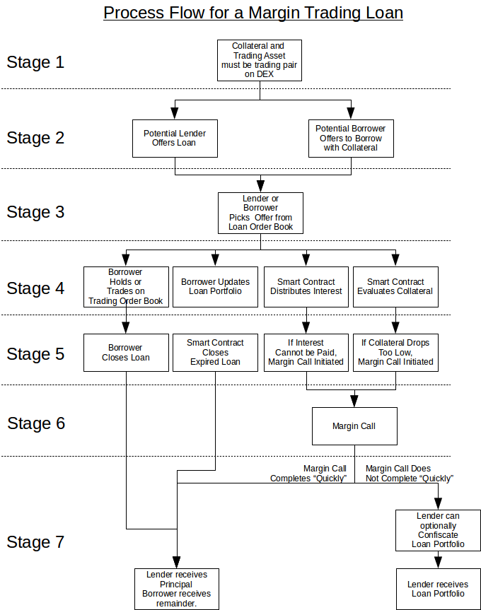

    BSIP: <BSIP number>
    Title: Lending for Margin Trading (Variant A)
    Authors: George Harrap, Michel Santos
    Status: Draft
    Type: Protocol
    Created: 2019-04-29
    Discussion: <url>
    Worker: <Id of worker proposal> (optional)

# Abstract

This BSIP defines a protocol upgrade in order to support a Peer-to-Peer lending, borrowing and margin trading markets on the BitShares DEX. Lending is defined as any user of the BitShares DEX having the ability to post an offer to lend any BitShares asset they own to a market where a borrower may take that offer (by posting collateral) and pay the lender a lender defined amount of interest over a time period.

The Borrower may choose to take the offer or post their preferred borrowing interest rate as a Bid and when taken, execute an exchange transaction with that token for another specified by the lender. The borrower will pay the lender interest and should the value of their margin position fall by a specified amount, the borrowers' balance will be margin called and sold on the market to payback the debt to the lender. The borrower risks losing their collateral in the case of a margin call and the lender risks the orderbook depth being insufficient to pay back their loan in the specified market.

# Motivation

BitShares is the longest running decentralised cryptocurrency exchange and one of the pioneers of collateralised stablecoins. While the BitShares DEX makes it easy to trade in an environment where users have custody of their own keys, there are opportunities to be made to improve liquidity, onboard new users and affect great trading activity on the BitShares DEX.

The highest volume and most liquid exchanges in the world to date like Bitmex and Bitfinex who rose to dominance due to their usage of leverage in catalysing greater liquidity for their customers.

With this in mind, some of the key inhibitors to growth right now for the BitShares DEX include:

_Incentive for Smartcoin creation / holding_: The growth in liquidity of Smartcoins like bitUSD, BitCNY, BitEUR and others depends on users locking up BTS collateral to create these assets. For users engaged in creating these assets they must often manage exposure to a highly volatile collateral asset and are not paid for taking on the risk which could reduce potential new issuance.

_Smartcoin Liquidity_: The most liquid BitShares markets are often the smart coin markets, however the liquidity of Smartcoins in circulation on the orderbook is not yet comparable to larger teir centralised exchanges thereby reducing potential usage of the BitShares DEX.

Counterparty risk of crypto lending: Currently one of the only ways with market traction to earn passive income on cryptocurrency holdings is to trust a centralised counterparty and give up ownership of your money to another entity. This is highly risky with users no longer in control of their funds and at risk of hacking or confiscation.

_BTS Price growth_: The Bitshares token (BTS) is the underlying collateral required for committee issued assets and therefore a higher Bitshares price incentivises greater Smartcoin creation. Growing demand for BitShares assets promotes higher collateralisation of BTS which requires more BTS being removed from circulation which over time reduces supply and can increase positive price pressure.

The motivation behind this BSIP is to address these concerns and increase user demand, liquidity and passive income opportunities for users of the BitShares DEX.

# Rationale

This BSIP seeks to address the inhibitors to growth in the BitShares DEX by introducing P2P Lending, Borrowing and Margin trading markets on the BitShares DEX. This new functionality would address the above concerns as follows:

Passive risk adjusted income: Any user may choose to lend any BitShares asset for a user defined rate of return over a specified time period. This not only provides an added incentive to hold an asset that can return a yield but also ensures existing liquidity of BitShares assets is deployed to the trading orderbook.

On-chain lending and borrowing reduces risk: Users seeking a return would not need to trust third party intermediaries with their funds and can engage in lending and borrowing contracts on the BitShares DEX. This reduces risk compared to competing centralised non-custodial competitors.

_Increased DEX liquidity_: With the ability for users to lend new or existing liquidity directly to the orderbooks, it provides greater order book depth than exists currently. This reduces risk for margin traders who rely on ample orderbook depth to ensure their positions can be adequately executed at a desired price or in the case of margin calls greater depth reduces collateral losses.

_Long / Short any asset on the DEX_: A user could borrow or lend any asset on the DEX adding new opportunities to make money from market movements especially in bear markets. This also enables smartcoin issuers to hedge their BTS (or other) exposure which could assist these users maintain adequate MCR ratios thereby reducing global settlement risk.

_Added volume and usage of BTS_: Every operation on the BitShares DEX requires a fee to be paid which returns BTS to the reserve pool. Greater usage of the BitShares DEX increases fees paid, reduces supply which can result in a positive price pressure on BTS. Additionally new smartcoin issuance for committee assets and some private assets requires BTS as collateral and therefore increased issuance also requires the purchase and lock up of BTS, increasing demand of BTS.

The BitShares DAC is well situated to capture a market opportunity in this space with the core intent of this BSIP to increase the viability of the BitShares DEX as a high volume, non-custodial, transparent and liquid trading exchange.

# 
 Specifications

The process flow for margin trading is depicted below.  The process will be described as consisting of seven stages with some stages containing parallel processes.

1. [Stage 1](#process-reference-price): Prior to any loan being offered or accepted, it must be possible to look up a _recent_ price between the trading asset and the the collateral asset on the internal DEX market
2. [Stage 2](#process-loan-offers): Lenders and potential Borrowers can place offers on the _Lending Order Book_.  The offers by lenders ("loan asks") and the offers by borrowers ("loan bids") will remain on the books until they either expire or are selected by account holders who are willing to accept those offers.
3. [Stage 3](#process-loan-matching): A reviewer of the Lending Order Book may select any existing offer.
4. [Stage 4a](#process-margin-trading): A borrower/ may hold the borrowed asset and/or trade against the agreed-upon tradeable asset for the _duration of the loan offer_.  [Stage 4b](#process-interest-payment): The smart contract will transfer interest payments from the borrower's loan portfolio to the lender on a daily basis.  [Stage 4c](#process-loan-appraisal) The smart contract will appraise the loan to check whether sufficient collateral backs the loan.  [Stage 4d](#process-portfolio-updating): A borrower may update the amount of collateral in their loan.
5. [Stage 5a](#process-loan-closure-initiation): _A borrower_ may initiate a loan closure any time prior to the loan expiration.  [Stage 5b](#process-loan-expiration): _The smart contract_ may initiate a margin call when the loan expires.  [Stage 5c](#process-margin-call-initiation-due-to-inability-to-pay-interest): _The smart contract_ may initiate a loan closure if it is unable to pay the daily interest on behalf of the borrower.  [Stage 5d](#process-margin-call-initiation): _The smart contract_ may initiate a loan  closure by margin call if appraises the loan's collateral as being too low.
6. [Stage 6](#process-margin-call): During a margin call process the smart contract attempts to liquidate a [loan portfolio](#process-margin-trading) by selling the balance of the tradeable asset on the market to obtain a sufficient balance of the borrowed asset to repay the lender.
7. [Stage 7a](#process-loan-closure): During a loan closure, the lender is repaid what is [owed](#debt-owed) and any balance of assets that remain in the [loan portfolio](#process-margin-trading) are transferred to the borrower's regular set of balances.  [Stage 7b](#process-portfolio-confiscation): Alternatively, if a margin call was initiated and does not complete within a certain amount of time, the lender may **optionally** confiscate the [loan portfolio](#process-margin-trading).

## 
 Stage 1: Reference Price

Knowledge of the exchange rate between the lent asset and the collateral asset is essential for the smart contract to automatically appraise a lender's margin account during the [loan appraissal](#process-loan-appraisal) and to evaluate the need for a possible [margin call](#process-margin-call-initiation).  This price shall be determined by the smart contract from the recent exchange rate (TBD: how recent?  last exchange?  averaged?) of that pair of assets _on the decentralized exchange and not from any external price feeds_.

## 
 Stage 2: Offers to Lend and Borrow

Both potential lenders and potential borrowers can place offers on Loan Order Book.  Potential lenders place "loan asks" and potential borrowers place "loan bids".  Offers to lend consist of the following conditions:

|Lending Offer Parameter|Description|
|-|-|
|
 Asset type to lend|The asset type that the lender is offering to lend|
|_Maximum_ amount to lend|The maximum amount of the asset type that the lender is offering|
|Asset type as collateral|The asset type that the borrower must provide for collateral.  _For this initial version of margin trading, this shall be the same asset type as the asset type to lend._|
|Maintenance collateral ratio (MCR)|The _minimum_ collateral ratio that is lender is expecting at the beginning of a loan.  MCR &ge; MCCR &ge; 1|
|Margin call collateral ratio (MCCR)|The _minimum_ collateral ratio below which [a margin call of the loan is initiated](#process-margin-call-initiation).  MCR &ge; MCCR &ge; 1|
|
 Asset type to trade against (Tradeable asset)|The asset type that the lender permits the borrower to trade against.  This restriction protects the lender from exit scam trading.|
|_Maximum_ duration of loan|The _maximum_ duration of the loan that the lender is willing to accept|
|Minimum interest rate|The _minimum_ daily interest rate that the lender is willing to accept|
|Expiration date|Expiration date of the offer|

|Borrowing Offer Parameter|Description|
|-|-|
|
 Asset type to borrow|The asset type that the borrower is seeking|
|_Maximum_ amount to borrow|The maximum amount of the asset type that the borrower is will borrow|
|Asset type as collateral|The asset type that the borrower must provide for collateral.  _For this initial version of margin trading, this shall be the same asset type as the asset type to lend._|
|Maintenance collateral ratio (MCR)|The _maximum_ collateral ratio that the borrower is willing to offer at the beginning of a loan.  MCR &ge; MCCR &ge; 1|
|Margin call collateral ratio (MCCR)|The _maximum_ collateral ratio below which [a margin call of the loan is initiated](#process-margin-call-initiation).  MCR &ge; MCCR &ge; 1|
|Asset type to trade against (Tradeable asset)|The asset type that the borrower can trade against.|
|_Minimum_ duration of loan|The _minimum_ duration of the loan that the borrower is willing to accept|
|_Maximum_ interest rate|The _maximum_ daily interest rate that the borrower is willing to accept|
|Expiration date|Expiration date of the offer|

After an offer is created, all users shall be able to identify:
- which unmatched offers are on the Lending Order Book, and
- which offers are matched.

Users shall have the ability to filter offers either by type (loan bid or loan ask), asset type to loan, tradeable asset type, amounts, interest rate, loan duration, maintenance collateral ratio, and margin call collateral ratio.  This capability shall either be done at the Core RPC-API node and/or at the user interface.  Offers to lend and offers to borrow shall have unique identifiers which can be referenced for [loan matching](#process-loan-matching).

The creation of offers, their partial and complete matches, their expiration, and their closures, shall be recorded as part of the account history of the lender and the borrower.

Offers to lend and borrow shall remain on the Loan Order Book until they either are canceled by the lender, expire, or are completely [matched](#process-loan-matching).

## 
 Stage 3: Loan Matching

_Matching of loans_, in this initial version of Lending for Margin Trading, _shall be an action taken by account holders who actively agree to specific loan offers by their offer identifier._  Automatic matching of offers on the Lending Order Book may be considered in a future BSIP.

When the agreement is matched, the borrower's collateral asset and the corresponding lender's loan asset shall be moved into the borrower's [loan-related portfolio](#process-margin-trading).

### Acceptance to Borrow

An acceptance to borrow, _which is techinically an acceptance of an existing lend offer_, shall be made by a borrower indicating the following in an operation:

|Agreement to Lending Offer Parameter|Description|
|-|-|
|Lending Offer ID|Identifier of an existing and open loan offer|

### Acceptance to Lend

An acceptance to lend, _which is technically an acceptance of an existing borrow offer_, shall be made by a lender indicating the following in an operation:

|Agreement to Borrow Offer Parameter|Description|
|-|-|
|Borrow Offer ID|Identifier of an existing and open offer to borrow|

### 
 Amount of Collateral

The amount of initial collateral (K) that is provided by the borrower shall be greater than or equal to

K &ge; (MCR - 1) &times; P

where MCR is the maintenance collateral ratio (MCR) and P is the principal amount that is provided by the lender.

---

**Example of Matching a Loan Offer**

A potential lender offers to lend 70 bitUSD with an maintenance collateral ratio of 142.9%.  A borrower accepts the terms by offering 30.03 bitUSD as maintenance collateral.

The offer and acceptance will be matched, and the borrower's loan-related portfolio is opened with a total of 100.03 bitUSD.

---

---

**Example of Matching a Borrow Offer**

A potential borrower offers to borrow with 15 bitUSD collateral with an maintenance collateral ratio of 130%.  A lender accepts the terms by offering 50 bitUSD as financing.

The offer and acceptance will be matched, and the borrower's loan-related portfolio is opened with a total of 65.00 bitUSD.

---

### 
 Duration of Accepted Loan

The duration of the accepted loan shall be the duration that was specified in the offer.  Acceptance of a loan duration that is shorter than the offer may be considered in a future BSIP.

The start date of the loan shall be when the loan is matched.  The end date of the loan shall be calculated by adding the duration to the start date.  The loan may be closed:

- [by the borrower before the end date](#process-loan-closure),
- [by the smart contract when the end date arrives](#process-loan-expiration), or
- [by the smart contract before the end date if the loan portfolio is undervalued](#process-margin-call-initiation).

### Filling of Loan Offers

Filling of offers shall require, in this initial version of Lending for Margin Trading, complete fulfillment of an offer and shall not permit partial filling.  Partial filling of offers on the Lending Order Book may be considered in a future BSIP.

## 
 Stage 4a: Margin Trading within Loan Portfolio

Assets that are borrowed shall be placed into the borrower's margin trading "loan portfolio".  _This portfolio shall only be used for trading on the decentralized exchange in the market pair consisting of the ["Asset type to lend/borrow"](#lend-asset) and the ["Asset type to trade against"](#tradeable-asset).  It shall not be possible to transfer funds to any account, nor use any of the assets as collateral to create another pegged asset on BitShares._

Any assets obtained from trading shall by placed into the loan portfolio and shall also be restricted to trading between the pair of asset types defined in the loan agreement.  [Conditional withdrawals of the tradeable asset](#withdrawals) by the borrower shall be permitted.  [Deposit of the lent asset](#deposits) by the borrower shall also be permitted.

### 
 Trading Limits

A borrower shall be able to use the [borrowed asset type](#borrow-asset) in the loan portfolio to trade against the tradeable asset on the order book of the market pair.  _The amount_ of the borrowed asset type (B) that may be used for placing new orders shall be limited to ensure that the loan portfolio's _balance of the borrowed asset_ exceeds the [minimum collateral](#initial-collateral) (K).  Before a trade the liquid balance of the asset type is Bliquidbefore.  The liquid balance of the asset type after a new order (Btradenew) can be calculated as

Bliquidafter = Bliquidbefore - Btradenew

The new liquid balance must satisfy the following condition and [definition for collateral](#initial-collateral)

Bliquidafter &ge; K = (MCR - 1) &times; P

which can be re-arranged as

Btradenew &le; Bliquidbefore - (MCR - 1) &times; P

This expresses a maximum amount for any new limit orders where the borrowed asset is offered to trade.  If this amount is negative, no new trades shall be permitted.

### 
 Multiple Loan Portfolios

A borrower may have multiple outstanding loans each with their own distinct loan portfolio.  Trading of assets from each loan portfolio shall be independent of other loan portfolios that are controlled by the borrower.  Trade orders shall only draw from assets within a single loan portfolio.

The distinction of loan portfolios from each other are intended to segregate the risk of each loan which can have separate loan durations, margin collateral ratios, and tradeable assets.  This segregation should better secure the lenders than a single co-mingled loan portfolio.

User interfaces that facilitate trading for a borrower may optionally aggregate multiple loan portfolios into a single "margin trading wallet" to disguise the fact that multiple loan portfolios are being tracked.

## 
 Stage 4b: Daily Interest Payment

Thee daily interest due (Ddaily) on the prinicpal (P) shall be calculated as

Ddaily = P &times; (1 + Rdaily)

where Rdaily is daily interest rate.  This daily interest shall be calculated in terms of the lent asset type.

The daily interest that is due shall be deducted from the borrower's balance of the [borrowed asset type](#borrow-asset) in the loan portfolio and deposited into the lender's account.  If the borrower's loan portfolio holds insufficient balance of the lent asset type to pay the daily interest then [a margin call shall be initiated](#process-margin-call-initiations).

When a [loan is closed](#process-loan-closure) the interest for that last day shall be paid at that time.

## 
 Stage 4c: Appraisal of Loan Portfolio

### 
 Debt Owed

The debt owed by a borrower for a particular loan is the amount lent by the lender.  [Interest is due on a daily basis](#process-interest-payment).

### 
 Portfolio Appraisal

A borrower may have many outstanding loans which are owed to different borrowers.  Each [loan portfolio](#process-margin-trading) will _initially_ consist of the principal that is lent by the lender plus the initial collateral that is provided by the borrower.  The borrowed asset and the collateral asset shall initially be the same asset type (B).

After the loan is initiated, the borrower may use that asset type to trade against the tradeable asset type (T) that is permitted by the loan, and/or may hold the borrowed asset.  Therefore this loan-related portfolio may consist of balances of two asset types: the [borrowed asset type](#borrowed-asset), and the [tradeable asset type](#tradeable-asset).

PA  = B + T

 While a loan is outstanding the balance of the borrowed asset and tradeable asset may consist as either liquid balances in their loan portfolio or as open orders on the order book.  Therefore the entire loan portfolio may be categorized as consisting of four parts:

- a balance of borrowed asset that is liquid (Bliquid)
- a balance of tradeable asset that is liquid (Tliquid)
- a balance of borrowed asset that is in open order (Borders)
- a balance of tradeable asset that is in open order (Torders)

PA  = Bliquid + Tliquid + Borders + Tliquid

The market price of the portfolio shall also be denominated in terms of the borrowed asset type for purposes of appraisal by the smart contract.  The market price of the borrower's loan-related portfolio shall consist of the market price of the two assets in the portfolio at the time of interest.

- The market price of the liquid balance and order balance of the borrowed asset shall simply be their sum.
- The market price of the luquid balance and order of the tradeable asset _shall be denominated in the borrowed asset type_ by the smart contract with the use of [reference price](#process-reference-price).

---

**Example of Portfolio Appraisal**

Bob borrowed 70 bitUSD 203.3 days ago while supplying by supplying 30.03 bitUSD as collateral.  Bob has been margin trading with this loan portfolio against bitBTC and currently has a balance of 45 bitUSD and 0.025 bitBTC.  The current reference price indicates that bitBTC is priced at 5000 bitUSD per bitBTC.  This loan portfolio will be appraised (PA) at:

PA = (45 bitUSD) + (0.025 bitBTC &times; 5000 bitUSD &div; bitBTC)

... = (45 bitUSD) + (125 bitUSD)

... = 170 bitUSD

---

### 
 Collateral Ratio

After [the calculation](#appraisal-triggers) of a [portfolio appraisal](#portfolio-appraisal) (PA) and the [debt owed](#debt-owed) (D), the collateral ratio (CR) shall be calculated as

CR = PA &div; D

At the beginning of the loan, the collateral ratio will satisfy the following conditions.

CR &ge; MCR &ge; MCCR &ge; 1

### 
 Derived Prices

The maintenance collateral price (MCP) of the loan portfolio is denominated in the [borrowed asset](#borrow-asset) and equals

MCP = MCR &times; D

where D is the [debt owed](#debt-owed).

Similarly, the margin call collateral price (MCCP) of the loan portfolio is denominated in the [lent asset](#lend-asset) and equals

MCCP = MCCR &times; D

It is desired for the [appraised price of the portfolio](#portfolio-appraisal) (PA) to be greater than or equal this value

PA &ge; MCP &ge; MCCP &ge; D

but it is possible for this price to fall below the MCP.  If

PA &lt; MCCP

a [margin call shall be initiated](#process-margin-call-initiation).

### 
 Triggering of Appraisal

Portfolio appraisals shall be triggered once per day _before_ the smart contract withdraws daily interest from the loan portfolios to pay the lenders.  This sequence should be beneficial to ensure that [minimum collateral evaluations](#process-margin-call-initiation) are not preempted by loan closures that are [triggered by insufficient balances to pay daily interest](#process-margin-call-initiation-due-to-inability-to-pay-interest).

## 
 Stage 4d: Loan Portfolio Updates

### Status of Loan Portfolio

The [appraisal value](#portfolio-appraisal), [debt owed](#debt-owed), [collateral ratio](#collateral-ratio), and [derived prices](#derived-prices), and  of the portfolio shall be able to be queried by the lender and borrower at any time.

### 
 Deposits

A borrower shall be able to deposit additional amounts of the [borrowed asset](#borrow-asset] into the loan portfolio.  A borrower may choose to deposit additional collateral to avoid having the [loan be margin called](#process-margin-call-initiation).

### 
 Withdrawals

A borrower shall be able to withdraw **only the tradeable asset** as long as _the market price of the portfolio (PA) **after the withdrawal** is greater than or equal to the [maintenance collateral price](#derived-prices)_.  The withdrawal limit (Wlimit) is defined as

Wlimit = PA - MCP

where MCP is [maintenance collateral price](#derived-prices) and PA is [portfolio appraisal](#portfolio-appraisal).

---

**Example of Withdrawal**

Bob borrowed 70 bitUSD 203 days ago at a daily interest rate of 0.0261% while supplying by supplying 30.03 bitUSD as collateral to satisfy the offer's 142.9% maintainance collateral ratio.

The debt owed is still 70 bitUSD.  The [maintenance collateral price](#derived-prices) (MCP) of the portfolio is

MCP = MCR &times; D

... = 1.429 &times; 73.8276 bitUSD

... = 105.4996 bitUSD

During this time Bob has been margin trading with this loan portfolio against bitBTC and currently has a balance of 45 bitUSD and 0.025 bitBTC.  The current reference price indicate that bitBTC is priced at 5000 bitUSD per bitBTC.  This loan portfolio will be appraised at:

PA = (45 bitUSD) + (0.025 bitBTC &times; 5000 bitUSD &div; bitBTC)

... = (45 bitUSD) + (125 bitUSD)

... = 170 bitUSD

The borrower may withdraw up to _the equivalent_ (Wlimit) of

Wlimit = PA - MCP

... = 170 bitUSD equivalent - 105.4996 bitUSD equivalent

... = 64.5004 bitUSD equivalent

The withdrawal limit denominated in bitBTC is

Wlimit = (64.5004 bitUSD &div; (5000 bitUSD &div; bitBTC))

... = 0.01291 bitBTC

Bob may withdraw bitBTC up to this limit because the balance of bitBTC, 0.025, exceeds this amount.  If the balance of the tradeable asset were, for example, only 0.1 bitBTC then Bob would only be able to withdraw 0.1 bitBTC.

---

## 
 Stage 5a: Initiation of Loan Closure by Borrower

A borrower may close an outstanding loan position by having a sufficient balance of the borrowed asset type in the loan-related portfolio and then initiating a loan closure with the appropriate parameters.

|Initiation of Loan Closure Parameter|Description|
|-|-|
|Lending Offer ID|Identifier of an existing and open loan offer|

The initiation of a loan closure shall close any and all open trade orders that are related to this loan.  If the balance of the borrowed asset type is insufficient to repay the prinicipal plus accrued interest then the initiation of the loan closure will be rejected.  _It is the responsibility of the borrower to ensure a sufficient balance in the borrowed asset type to repay the loan._

## 
 Stage 5b: Expiration of Loan

The smart contract shall initiate a [margin call](#process-margin-call) if an outstanding loan [expires](#loan-duration).

A future BSIP may consider automatically repaying the lender from available balances, and opening a new loan from any existing offers on the Loan Order Book.

## 
 Stage 5c: Initiation of Loan Closure because of Insufficient Funds

A loan portfolio may categorized as consisting of [four components of balances](#portfolio-components) of which one is the balance of borrowed asset that is liquid (Bliquid).  This balance is drawn from to pay the daily interest.  If this balance is insufficient to pay the interest then a loan closure shall be initiated.

## 
 Stage 5d: Initiation of Loan Closure by Margin Call

If the [collateral ratio](#collateral-ratio) ever drops below the margin call collateral ratio,

CR &lt; MCCR

the smart contract shall initiate a [margin call](#process-margin-call).

## 
 Stage 6: Margin Call

### Restriction of Loan Portfolio

When a margin call is initiated on a specific loan portfolio, no new market orders may be initiated that make use of any balance in the loan portfolio.  _Any other loan portfolios that the borrower might have shall not be affected by margin calls on other loans._

Any open market orders that are related to that specific loan portfolio shall be cancelled.

### 
 Liquidation Plan

The smart contract shall determine whether the balance of the [borrowed asset](#borrowed-asset) is sufficient to pay what is [owed](#debt-owed).  If the balance is insufficient, the smart contract shall place an "effective" market order of the entire balance of the tradeable asset.  _The effective market order shall be performed by creating a limit order asking for one satoshi of the borrowed asset type in exchange for the entire balance of the tradeable asset_.

### Monitoring of Liquidation Plan

It shall be possible to monitor the status of the liquidation plan associated with any margin call.  An inquiry into the status of the liquidation plan shall return:
- how much of the [tradeable asset](#tradeable-asset) was originally being liquidated,
- how much of the [tradeable asset](#tradeable-asset) has been sold, and
- how much of the [borrowed asset](#borrowed-asset) has been obtained as a result of the liquidation.

### 
 Completion of Margin Call

The [loan-closure process](#process-loan-closure) shall begin after the liquidation plan is completed.

## 
 Stage 7a: Loan Closure

If loan closure was [initiated by the borrower](#process-loan-closure-initiation), the lender will be repaid what was [owed](#debt-owed) at the initiation plus [interest for that day](#process-interest-payment).  If loan closure was initiated by the [completion of a margin call](#margin-call-completion), the lender will be repaid what was [owed](#debt-owed) at the commencement of the margin call process plus [interest for that day](#process-interest-payment).

A future BSIP may consider re-lending a lenders balance by automatically creating a new offer on the Loan Order Book on behalf of the lender.

If the loan portfolio has insufficient balance of the [lent asset](#lend-asset) to repay the lender then the loan will still be closed.

Any balances that remain in the loan portfolio after repaying the lender shall be transferred to the borrower's regular set of balances and shall no longer be encumbered by any restrictions.

## 
 Stage 7b: Portfolio Confiscation

A loan portfolio may be [margin called](#process-margin-call) and enter the [liquidation process](#liquidation-plan).  If demand for the collateral asset is low enough, the collateral might not be purchased on the market and thereby preventing the [loan portolio from being closed](#margin-call-completion) (i.e. "stuck" loan portfolio).  If a margin called loan portfolio exceeds a [pre-defined duration](#margin-call-protection-duration) **the lender shall be permitted to confiscate and close the entire loan portfolio**.  This option is at the discretion of the lender.

## 
 Definable Loan Constraints

The BitShares Committee shall be able to define parameters that can constrain _new_ loans; changes to these values shall not affect _loans that were **offered**_ before the change:

|Term|Description|
|-|-|
|Maximum loan durations|The maximum duration for a new loan offer|
|Minimum MCR|The minimum maintenance collateral ratio (MCR) that may be agreed upon|
|Minimum MCCR|The minimum margin call collateral ratio (MCCR) that may be agreed upon|
|Maximum interest rates|The maximum interest rate that may be agreed upon|
|
 Duration of margin call protection|The duration during which a borrower's loan portfolio shall be protected from [confiscation by the lender](#process-portfolio-confiscation).  _This duration shall be recorded as part of the loan portfolio at the time that the loan is matched so that subsequent changes of this setting will not alter existing loans._|

### 
 Fees

Fees shall be defined for each of the operations:

- creation of a lend offer
- creation of a borrow offer
- canceling an open offer
- depositing additional collateral
- withdrawing assets from a loan portfolio
- closing a loan

The standard fees for placing orders shall apply.

## 
 Software Specifications

- TBD: Computational load of determining ["recent" exchange rate of market pair](#process-reference-price)
- TBD: The [interest payment](#process-interest-payment) may potentially be small enough that it falls below the precision of the asset type.  In such a situation the loan will effectively become a free loan.
- TBD: Computational load paying [daily interest](#process-interest-payment)
- TBD: When and how often should [loan appraisals be triggered](#appraisal-triggers)?
- TBD: Computational load of [loan appraisal](#process-loan-appraisal)
- TBD: Memory load of maintaining [multiple open loans](#multiple-loan-portfolios) and [loan offers](#process-loan-offers)

# Discussion

## Risks

### Financial: Price of a market pair on the DEX

A stagnant, nascent, or illiquid order book on the DEX for a particular market pair might not reflect the price of the collateral _according to external market pairs_.  That will affect the [appraisal value of the loan collateral](#process-loan-appraisal) which then affects margin calculations.  Margin calculations affect boths future loan offers on the books and [matched loans](#process-margin-call-initiation).

Potential lenders and borrowers should carefully review internal market pair and compare it with the external market pair to determine (a) whether internal market reflects a reasonable exchange ratio/price, and (b) whether the internal market could be easily manipulated to either overvalue or undervalue collateral.

### Financial: Margin Calls at Market Price

If a [margin call is initiated](#process-margin-call-initiation) _and_ if a [liquidation plan](#liquidation-plan) requires selling the tradeable asset to repay the lender in [lent asset type](#lend-asset), _borrowers should be aware that it will be sold as an effective market order_.  **The resulting sale on the DEX order book may return much less than if the offer were made on an external market.**

### Financial: Repayment of a Margin Called Loan

Loans that are margin called might require a liquidation plan that involves [placing an effective market order to buy enough of the lent asset](#liquidation-plans) to repay the loan.

_If the market order remains unfilled on the DEX order book for [sufficient time](#margin-call-protection-duration), **the lender has the option to [confiscate the entire loan portolio](#process-portfolio-confiscation) thereby leaving the borrower with nothing after the [loan closure](#process-loan-closure)**_.

_Even if the market order is filled **the resulting balance balance of the [lent asset](#lend-asset) might be insufficient to completely repay the lender.**_

# Summary for Shareholders

TO-DO

# Copyright

This document is placed in the public domain.

# See Also

- [BitShares Margin Trading and Swap Contracts on the Dex](https://medium.com/@George_harrap/bitshares-margin-trading-and-swap-contracts-on-the-dex-discussion-3856b00a8349)
- [https://bitsharestalk.org/index.php?topic=27250.0](https://bitsharestalk.org/index.php?topic=27250.0)
